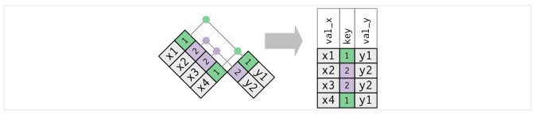

# Tidyverse

## Consultas de datos (dplyr)

Ahora que ya sabemos como cargar datos, aprenderemos como manipularlos con *dplyr.* El paquete *dplyr* proporciona un conjunto de funciones muy útiles para manipular data frames y así reducir el número de repeticiones, la probabilidad de cometer errores y el número de caracteres que hay que escribir. Como valor extra, podemos encontrar que la gramática de *dplyr* es más fácil de entender.

Revisaremos algunas de sus funciones **más usadas** (*verbos*), así como el uso de **pipes** (%>%) para combinarlas.

- select()

- filter()

- arrange()

- mutate()

- summarise()

- join()

- group_by()

Primero tenemos que instalar y cargar la paquetería (parte de tidyverse):

```{r,eval=TRUE}
# install.packages("dplyr")
library(dplyr)
```

Usaremos el dataset *iris* que se encuentra en la paquetería *datasets* (el alumno puede hacer el ejercicio con la base AmesHousing)

```{r}
head(iris,10)
```


### select()

Observamos que nuestros datos tienen 150 observaciones y 5 variables, con *select()* podemos seleccionar las variables que le indiquemos.

```{r}
select_ejemplo<-iris %>% select(Sepal.Length,Petal.Length,Species)
head(select_ejemplo,10)
```

El operador pipe (%>%) se usa para conectar múltiples acciones, en este caso solo le indicamos que en los datos de iris se seleccionan 3 varibles y se guarda este nuevo data frame en la variable *select_ejemplo*.


Con *select()* y *contains* podemos seleccionar varibles con alguna cadena de texto. 

```{r}
select_ejemplo<-iris %>% select(contains("Sepal"))
head(select_ejemplo,5)
```

De igual manera, con *select()*, *ends_with* y *start_with()* podemos seleccionar que inicien o terminen con alguna cadena de texto.

```{r}
select_ejemplo<-iris %>% select(starts_with("Sepal"),ends_with("Length"))
head(select_ejemplo,5)
```


Funciones útiles para *select()*:

- *contains()*: Selecciona variables cuyo nombre contiene la cadena de texto.

- *ends_with()*: Selecciona variables cuyo nombre termina con la cadena de caracteres.

- *everything()*: Selecciona todas las columnas.

- *matches()*: Selecciona las variables cuyos nombres coinciden con una expresión regular.

- *num_range()*: Selecciona las variables por posición.

- *start_with()*: Selecciona variables cuyos nombres empiezan con la cadena de caracteres.

- *any_of*: Selecciona cualquiera de estas variables, en caso de existir


### filter()

La función filter nos permite filtrar filas según una condición, primero notemos que la variable *Species* tiene tres categorías.

```{r}
table(iris$Species)
```

Ahora usaremos la función *filter* para quedarnos solo con las observaciones de la especie virginica.

```{r}
ejemplo_filter<- iris %>% filter(Species=="virginica")
head(ejemplo_filter,5)
```


También se puede usar para filtrar variables numéricas:

```{r}
ejemplo_filter<- iris %>% filter(Sepal.Length>5 & Sepal.Width>=3.5)
head(ejemplo_filter,5)
```

Notemos que en el ejemplo anterior usamos *&*, que nos ayuda a filtrar por dos condiciones.

También podemos usar *|* para filtrar por alguna de las dos condiciones.

```{r}
ejemplo_filter<- iris %>% filter(Sepal.Length>5 | Sepal.Width>=3.5)
head(ejemplo_filter,5)
```


Las condiciones pueden ser expresiones lógicas construidas mediante los operadores relacionales y lógicos: 

- **<** : Menor que

- **>** : Mayor que

- **=** : Igual que

- **<=** : Menor o igual que

- **>=** : Mayor o igual que

- **!=** : Diferente que

- **%in%** : Pertenece al conjunto

- **is.na** : Es NA

- **!is.na** : No es NA


###  arrange()

La función arrange() se utiliza para ordenar las filas de un data frame de acuerdo a una o varias variables. 

Por defecto arrange() ordena las filas por orden ascendente: 

```{r}
ejemplo_arrange<- iris %>% arrange(Sepal.Length)
head(ejemplo_arrange,10)
```

<br>
<br>
Si las queremos ordenar de forma ascendente lo haremos del siguiente modo: 

```{r}
ejemplo_arrange<- iris %>% arrange(desc(Sepal.Length))
head(ejemplo_arrange,10)
```


###  mutate()

Con la función mutate() podemos computar tranformaciones de variables en un data frame. A menudo, tendremos la necesidad de crear nuevas variables que se calculan a partir de variables existentes,mutate() nos proporciona una interface clara para realizar este tipo de operaciones. 

Por ejemplo haremos la suma de las variables *Sepal.Lenght* y *Sepal.Width*:

```{r}
ejemplo_mutate<- iris %>% select(Sepal.Length,Sepal.Width) %>%
  mutate(Suma=Sepal.Length+Sepal.Width)
head(ejemplo_mutate,5)
```

Notemos que en el ejemplo anterior usamos dos *pipes* (%>%), como habiamos mencionado se pueden usar los necesarios para combinar funciones. 


### summarise()

La función summarise() funciona de forma análoga a la función mutate, excepto que en lugar de añadir nuevas columnas crea un nuevo data frame.

Podemos usar el ejemplo anterior y calcular la media de la varible creada *Suma*:

```{r}
ejemplo_summarise<- iris %>% select(Sepal.Length,Sepal.Width) %>%
  mutate(Suma=Sepal.Length+Sepal.Width) %>%
  summarise(Media_Suma=mean(Suma))
ejemplo_summarise
```

Solo fue necesario agregar un *pipe*, especificar el nombre de la varible creada y la operación a realizar.


A continuación se muestran funciones que trabajando conjuntamente con la función summarise() facilitarán nuestro trabajo diario. Las primeras pertenecen al paquete base y las otras son del paquete dplyr. Todas ellas toman como argumento un vector y devuelven un único resultado:

- *min(), max()* : Valores max y min.

- *mean()* : Media.

- *median()* : Mediana.

- *sum()* : Suma de los valores.

- *var(), sd()* : Varianza y desviación estandar.

- *first()* : Primer valor en un vector.

- *last()* : El último valor en un vector

- *n()* : El número de valores en un vector.

- *n_distinc()* : El número de valores distintos en un vector.

- *nth()* : Extrar el valor que ocupa la posición n en un vector.


Mas adelante veremos como combinar esta función con la función *group_by*.


### group_by()

La función group_by() agrupa un conjunto de filas seleccionado en un conjunto de filas de resumen de acuerdo con los valores de una o más columnas o expresiones.

Usaremos el ejemplo anterior, primero creamos nuestra nueva variable *Suma*, despues agrupamos por especie y al final sacamos la media de la variable *Suma* pero esta vez, por la función *group_by*, nos regresara una media por cada grupo creado, es decir, nos regresara el promedio de la suma por especie.

```{r,warning=FALSE,message=FALSE}
ejemplo_groupby<- iris %>%
  mutate(Suma=Sepal.Length+Sepal.Width) %>%
  group_by(Species) %>%
  summarise(Media_Suma=mean(Suma))

ejemplo_groupby
```

### rowwise()

Esta función permite calcular nuevas variables *un renglón a la vez*.

```{r}
iris %>% 
  mutate(suma = sum(Sepal.Length, Sepal.Width, Petal.Length, Petal.Width)) %>% 
  ungroup()
```
¿Qué pasó en el ejemplo pasado?

Ahora veamos qué pasa al intriducir rowwise al pipeline
```{r}
iris %>% 
  rowwise() %>% 
  mutate(suma = Sepal.Length + Sepal.Width + Petal.Length + Petal.Width) %>% 
  ungroup()

iris %>% 
  rowwise() %>% 
  mutate(suma = sum(across(Sepal.Length:Petal.Width))) %>% 
  ungroup()
```

## Cruces de tablas

Una operación fundamental por agregar a nuestro flujo de trabajo es el cruce de tablas, las cuales pueden proceder de la misma o de distinta fuente. Comúnmente **este proceso se realiza para enriquecer y unificar la información** proveniente de distintas tablas de datos. 

Para lograr esta tarea es indispensable que exista una variable **llave** en ambos conjuntos de datos que sirva como puente o identificador de cada caso o renglón. Si se cuenta con la columna llave entonces será posible cruzar las tablas y lograr su enriquecimiento.

En el siguiente ejemplo se muestra el uso de la variable llave a través de la columna "ID". Se puede apreciar que en la tabla final se cuenta con información de la variable "Weight" para los elementos que existen en las tablas "A" y "B". 

```{r echo=FALSE,fig.align='center', out.width='700pt'}
knitr::include_graphics("img/03-tidyverse/left_join3.png")
```

La función que hace posible el complemento de la información es llamada *left_join()*. El primer argumento de la función corresponde al conjunto de datos que se desea complementar, mientras que en el segundo argumento se ingresa el conjunto de datos con la información que enriquecerá al primer conjunto. Es necesario especificar en el argumento *"by"* el nombre de la columna llave.

```{r}

conjuntoX <- data.frame("Llave" = LETTERS[1:8], "C1" = 1:8)

conjuntoY <- data.frame("Llave" = sample(LETTERS[11:3], size = 9, replace = T), 
                        "Ex1" = letters[2:10], 
                        "Ex2" = 1002:1010,"Ex3" = paste0(letters[12:20],2:10))

conjuntoX

conjuntoY

left_join(x = conjuntoX, y = conjuntoY, by = "Llave")

```


Es posible que no todas las observaciones de un conjunto de datos estén en el otro conjunto, cuando esto sucede un aviso aparece indicando que los factores o categorías de la variable llave son diferentes. En caso de no encontrarse uno o más de los valores, el resultado para esos casos será NA (no disponible, por su traducción del inglés "Not Available"), y aparecerá siempre que no se cuente con información en un registro, como se muestra en el ejemplo anterior.

Existen diferentes maneras de conjuntar datos. La primera, como en el ejemplo mostrado anteriormente, se hace por lo izquierda y quiere decir que, **al primer conjunto de datos es al que se le agregará la información del segundo conjunto**. Esto se realizará exclusivamente para aquellos registros del segundo conjunto que existan en el primero, los cuales se identifican mediante la llave definida. 

Otra manera de realizar la conjunción de los datos es por la derecha. Funciona de manera análoga a la primera, con la diferencia de que son los datos del primer conjunto los que se agregan al segundo. De igual manera, esto sólo ocurre para los elemento del primer conjunto que se encuentran en el segundo y que son identificables a través de una llave. La función en *R* que permite realizar la conjunción por la derecha lleva por nombre *right_join()*.

```{r}
right_join(x = conjuntoX, y = conjuntoY, by = "Llave")
```

Una tercer forma de unir los datos es a través de la función *full_join()*, la cual es una combinación de las dos anteriores. Agrega todos los elementos llave tanto del primer conjunto como del segundo y posteriormente realiza el cruce de información de ambos conjuntos.

```{r}
full_join(x = conjuntoX, y = conjuntoY, by = "Llave")
```

Estos 3 primeros métodos pueden resumirse en la siguiente imagen:

```{r echo=FALSE,fig.align='center', out.width='700pt'}
knitr::include_graphics("img/03-tidyverse/left_right_full_join.png")
```

Adicionalmente, existen otras funciones que ayudan con gestionar las operaciones entre conjuntos de datos. Tal es el caso de la función *inner_join()*, la cuál no es otra cosa que el filtro de aquellos elementos que se tengan en común en ambas tablas y la combinación de un *join*. Internamente, la función primero filtra el ID de aquellos elementos que tienen presencia en ambas tablas y finalmente hace el cruce de los datos.

```{r echo=FALSE,fig.align='center', out.width='700pt'}
knitr::include_graphics("img/03-tidyverse/inner_join.png")
```

```{r}
inner_join(x = conjuntoX, y = conjuntoY, by = "Llave")
```

Existen otras dos operaciones interesantes que agilizan la extracción de subconjuntos de tablas sin cruzar información. Se trata de las funciones *semi_join()* y *anti_join()*, las cuales funcionan de la siguiente manera:

La función *semi_join()* detecta y filtra los elementos del primer conjunto que se encuentran en un segundo conjunto, mientras que la función *anti_join()* es su complemento, pues regresa los elementos del primer conjunto que no se encuentran en el segundo. En ambos casos, la información contenida en el segundo conjunto no es trasmitida al resultado. 

```{r echo=FALSE,fig.align='center', out.width='700pt'}
knitr::include_graphics("img/03-tidyverse/semi_join.png")
```

A continuación se presenta su ejemplificación:

```{r}
semi_join(x = conjuntoX, y = conjuntoY, by = "Llave")
```
Ahora revisemos el caso de la función *anti_join()*

```{r echo=FALSE,fig.align='center', out.width='700pt'}
knitr::include_graphics("img/03-tidyverse/anti_join.png")
```

```{r}
anti_join(x = conjuntoX, y = conjuntoY, by = "Llave")
```

**WARNING: llaves duplicadas**

La mayoría de los ejemplos anteriores suponen que las llaves son únicas en cada conjunto de datos, sin embargo, esto no es cierto en una gran cantidad de ocasiones. Existen dos casos importantes por analizar:

* Llaves duplicadas en 1 conjunto de datos
* Llaves duplicadas en ambos conjuntos

El caso más sencillo es cuando solo uno de los conjuntos contiene llaves duplicadas. En este caso se creará un renglón por cada duplicado.

```{r echo=FALSE,fig.align='center', out.width='700pt'}

```

En el segundo caso, por cada elemento duplicado en el primer conjunto habrá como resultado un elemento por cada duplicado en el segundo conjunto. A continuación se ejemplifica este escenario.

```{r echo=FALSE,fig.align='center', out.width='700pt'}
knitr::include_graphics("img/03-tidyverse/duplicado2.png")
```


## Estructura de tablas

\begin{center}
"Las familias felices son todas iguales, cada familia infeliz es infeliz  a su propio modo."
\end{center}

\begin{flushright}
\text{- Leo Tolstoy}
\end{flushright}


## Manipulación de texto (stringr)


## Manipulación de fechas


