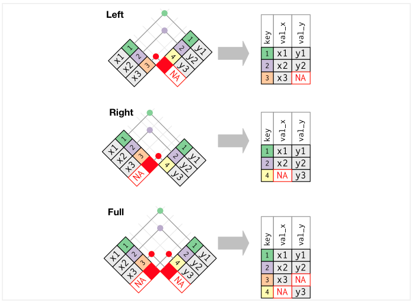
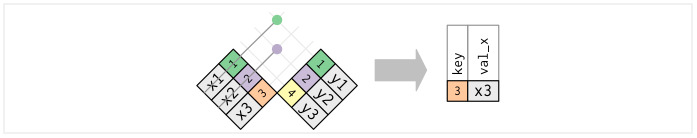

# Tidyverse

## Consultas de datos (dplyr)

Ahora que ya sabemos como cargar datos, aprenderemos como manipularlos con *dplyr.* El paquete *dplyr* proporciona un conjunto de funciones muy útiles para manipular data frames y así reducir el número de repeticiones, la probabilidad de cometer errores y el número de caracteres que hay que escribir. Como valor extra, podemos encontrar que la gramática de *dplyr* es más fácil de entender.

Revisaremos algunas de sus funciones **más usadas** (*verbos*), así como el uso de **pipes** (%>%) para combinarlas.

- select()

- filter()

- arrange()

- mutate()

- summarise()

- join()

- group_by()

Primero tenemos que instalar y cargar la paquetería (parte de tidyverse):

```{r,eval=TRUE}
# install.packages("dplyr")
library(dplyr)
```

Usaremos el dataset *iris* que se encuentra en la paquetería *datasets* (el alumno puede hacer el ejercicio con la base AmesHousing)

```{r}
head(iris,10)
```


### select()

Observamos que nuestros datos tienen 150 observaciones y 5 variables, con *select()* podemos seleccionar las variables que le indiquemos.

```{r}
select_ejemplo<-iris %>% select(Sepal.Length,Petal.Length,Species)
head(select_ejemplo,10)
```

El operador pipe (%>%) se usa para conectar múltiples acciones, en este caso solo le indicamos que en los datos de iris se seleccionan 3 varibles y se guarda este nuevo data frame en la variable *select_ejemplo*.


Con *select()* y *contains* podemos seleccionar varibles con alguna cadena de texto. 

```{r}
select_ejemplo<-iris %>% select(contains("Sepal"))
head(select_ejemplo,5)
```

De igual manera, con *select()*, *ends_with* y *start_with()* podemos seleccionar que inicien o terminen con alguna cadena de texto.

```{r}
select_ejemplo<-iris %>% select(starts_with("Sepal"),ends_with("Length"))
head(select_ejemplo,5)
```


Funciones útiles para *select()*:

- *contains()*: Selecciona variables cuyo nombre contiene la cadena de texto.

- *ends_with()*: Selecciona variables cuyo nombre termina con la cadena de caracteres.

- *everything()*: Selecciona todas las columnas.

- *matches()*: Selecciona las variables cuyos nombres coinciden con una expresión regular.

- *num_range()*: Selecciona las variables por posición.

- *start_with()*: Selecciona variables cuyos nombres empiezan con la cadena de caracteres.

- *any_of*: Selecciona cualquiera de estas variables, en caso de existir


### filter()

La función filter nos permite filtrar filas según una condición, primero notemos que la variable *Species* tiene tres categorías.

```{r}
table(iris$Species)
```

Ahora usaremos la función *filter* para quedarnos solo con las observaciones de la especie virginica.

```{r}
ejemplo_filter<- iris %>% filter(Species=="virginica")
head(ejemplo_filter,5)
```


También se puede usar para filtrar variables numéricas:

```{r}
ejemplo_filter<- iris %>% filter(Sepal.Length>5 & Sepal.Width>=3.5)
head(ejemplo_filter,5)
```

Notemos que en el ejemplo anterior usamos *&*, que nos ayuda a filtrar por dos condiciones.

También podemos usar *|* para filtrar por alguna de las dos condiciones.

```{r}
ejemplo_filter<- iris %>% filter(Sepal.Length>5 | Sepal.Width>=3.5)
head(ejemplo_filter,5)
```


Las condiciones pueden ser expresiones lógicas construidas mediante los operadores relacionales y lógicos: 

- **<** : Menor que

- **>** : Mayor que

- **=** : Igual que

- **<=** : Menor o igual que

- **>=** : Mayor o igual que

- **!=** : Diferente que

- **%in%** : Pertenece al conjunto

- **is.na** : Es NA

- **!is.na** : No es NA


###  arrange()

La función arrange() se utiliza para ordenar las filas de un data frame de acuerdo a una o varias variables. 

Por defecto arrange() ordena las filas por orden ascendente: 

```{r}
ejemplo_arrange<- iris %>% arrange(Sepal.Length)
head(ejemplo_arrange,10)
```

<br>
<br>
Si las queremos ordenar de forma ascendente lo haremos del siguiente modo: 

```{r}
ejemplo_arrange<- iris %>% arrange(desc(Sepal.Length))
head(ejemplo_arrange,10)
```


###  mutate()

Con la función mutate() podemos computar tranformaciones de variables en un data frame. A menudo, tendremos la necesidad de crear nuevas variables que se calculan a partir de variables existentes,mutate() nos proporciona una interface clara para realizar este tipo de operaciones. 

Por ejemplo haremos la suma de las variables *Sepal.Lenght* y *Sepal.Width*:

```{r}
ejemplo_mutate<- iris %>% select(Sepal.Length,Sepal.Width) %>%
  mutate(Suma=Sepal.Length+Sepal.Width)
head(ejemplo_mutate,5)
```

Notemos que en el ejemplo anterior usamos dos *pipes* (%>%), como habiamos mencionado se pueden usar los necesarios para combinar funciones. 


### summarise()

La función summarise() funciona de forma análoga a la función mutate, excepto que en lugar de añadir nuevas columnas crea un nuevo data frame.

Podemos usar el ejemplo anterior y calcular la media de la varible creada *Suma*:

```{r}
ejemplo_summarise<- iris %>% select(Sepal.Length,Sepal.Width) %>%
  mutate(Suma=Sepal.Length+Sepal.Width) %>%
  summarise(Media_Suma=mean(Suma))
ejemplo_summarise
```

Solo fue necesario agregar un *pipe*, especificar el nombre de la varible creada y la operación a realizar.


A continuación se muestran funciones que trabajando conjuntamente con la función summarise() facilitarán nuestro trabajo diario. Las primeras pertenecen al paquete base y las otras son del paquete dplyr. Todas ellas toman como argumento un vector y devuelven un único resultado:

- *min(), max()* : Valores max y min.

- *mean()* : Media.

- *median()* : Mediana.

- *sum()* : Suma de los valores.

- *var(), sd()* : Varianza y desviación estandar.

- *first()* : Primer valor en un vector.

- *last()* : El último valor en un vector

- *n()* : El número de valores en un vector.

- *n_distinc()* : El número de valores distintos en un vector.

- *nth()* : Extrar el valor que ocupa la posición n en un vector.


Mas adelante veremos como combinar esta función con la función *group_by*.


### group_by()

La función group_by() agrupa un conjunto de filas seleccionado en un conjunto de filas de resumen de acuerdo con los valores de una o más columnas o expresiones.

Usaremos el ejemplo anterior, primero creamos nuestra nueva variable *Suma*, despues agrupamos por especie y al final sacamos la media de la variable *Suma* pero esta vez, por la función *group_by*, nos regresara una media por cada grupo creado, es decir, nos regresara el promedio de la suma por especie.

```{r,warning=FALSE,message=FALSE}
ejemplo_groupby<- iris %>%
  mutate(Suma=Sepal.Length+Sepal.Width) %>%
  group_by(Species) %>%
  summarise(Media_Suma=mean(Suma))

ejemplo_groupby
```

### rowwise()

Esta función permite calcular nuevas variables *un renglón a la vez*.

```{r}
iris %>% 
  mutate(suma = sum(Sepal.Length, Sepal.Width, Petal.Length, Petal.Width)) %>% 
  ungroup()
```
¿Qué pasó en el ejemplo pasado?

Ahora veamos qué pasa al intriducir rowwise al pipeline
```{r}
iris %>% 
  rowwise() %>% 
  mutate(suma = Sepal.Length + Sepal.Width + Petal.Length + Petal.Width) %>% 
  ungroup()

iris %>% 
  rowwise() %>% 
  mutate(suma = sum(across(Sepal.Length:Petal.Width))) %>% 
  ungroup()
```

## Cruces de tablas

Una operación fundamental por agregar a nuestro flujo de trabajo es el cruce de tablas, las cuales pueden proceder de la misma o de distinta fuente. Comúnmente **este proceso se realiza para enriquecer y unificar la información** proveniente de distintas tablas de datos. 

Para lograr esta tarea es indispensable que exista una variable **llave** en ambos conjuntos de datos que sirva como puente o identificador de cada caso o renglón. Si se cuenta con la columna llave entonces será posible cruzar las tablas y lograr su enriquecimiento.

En el siguiente ejemplo se muestra el uso de la variable llave a través de la columna "ID". Se puede apreciar que en la tabla final se cuenta con información de la variable "Weight" para los elementos que existen en las tablas "A" y "B". 

```{r echo=FALSE,fig.align='center', out.width='700pt'}
knitr::include_graphics("img/03-tidyverse/left_join3.png")
```

La función que hace posible el complemento de la información es llamada *left_join()*. El primer argumento de la función corresponde al conjunto de datos que se desea complementar, mientras que en el segundo argumento se ingresa el conjunto de datos con la información que enriquecerá al primer conjunto. Es necesario especificar en el argumento *"by"* el nombre de la columna llave.

```{r}

conjuntoX <- data.frame("Llave" = LETTERS[1:8], "C1" = 1:8)

conjuntoY <- data.frame("Llave" = sample(LETTERS[11:3], size = 9, replace = T), 
                        "Ex1" = letters[2:10], 
                        "Ex2" = 1002:1010,"Ex3" = paste0(letters[12:20],2:10))

conjuntoX

conjuntoY

left_join(x = conjuntoX, y = conjuntoY, by = "Llave")

```


Es posible que no todas las observaciones de un conjunto de datos estén en el otro conjunto, cuando esto sucede un aviso aparece indicando que los factores o categorías de la variable llave son diferentes. En caso de no encontrarse uno o más de los valores, el resultado para esos casos será NA (no disponible, por su traducción del inglés "Not Available"), y aparecerá siempre que no se cuente con información en un registro, como se muestra en el ejemplo anterior.

Existen diferentes maneras de conjuntar datos. La primera, como en el ejemplo mostrado anteriormente, se hace por lo izquierda y quiere decir que, **al primer conjunto de datos es al que se le agregará la información del segundo conjunto**. Esto se realizará exclusivamente para aquellos registros del segundo conjunto que existan en el primero, los cuales se identifican mediante la llave definida. 

Otra manera de realizar la conjunción de los datos es por la derecha. Funciona de manera análoga a la primera, con la diferencia de que son los datos del primer conjunto los que se agregan al segundo. De igual manera, esto sólo ocurre para los elemento del primer conjunto que se encuentran en el segundo y que son identificables a través de una llave. La función en *R* que permite realizar la conjunción por la derecha lleva por nombre *right_join()*.

```{r}
right_join(x = conjuntoX, y = conjuntoY, by = "Llave")
```

Una tercer forma de unir los datos es a través de la función *full_join()*, la cual es una combinación de las dos anteriores. Agrega todos los elementos llave tanto del primer conjunto como del segundo y posteriormente realiza el cruce de información de ambos conjuntos.

```{r}
full_join(x = conjuntoX, y = conjuntoY, by = "Llave")
```

Estos 3 primeros métodos pueden resumirse en la siguiente imagen:

```{r echo=FALSE,fig.align='center', out.width='700pt'}

```

Adicionalmente, existen otras funciones que ayudan con gestionar las operaciones entre conjuntos de datos. Tal es el caso de la función *inner_join()*, la cuál no es otra cosa que el filtro de aquellos elementos que se tengan en común en ambas tablas y la combinación de un *join*. Internamente, la función primero filtra el ID de aquellos elementos que tienen presencia en ambas tablas y finalmente hace el cruce de los datos.

```{r echo=FALSE,fig.align='center', out.width='700pt'}
knitr::include_graphics("img/03-tidyverse/inner_join.png")
```

```{r}
inner_join(x = conjuntoX, y = conjuntoY, by = "Llave")
```

Existen otras dos operaciones interesantes que agilizan la extracción de subconjuntos de tablas sin cruzar información. Se trata de las funciones *semi_join()* y *anti_join()*, las cuales funcionan de la siguiente manera:

La función *semi_join()* detecta y filtra los elementos del primer conjunto que se encuentran en un segundo conjunto, mientras que la función *anti_join()* es su complemento, pues regresa los elementos del primer conjunto que no se encuentran en el segundo. En ambos casos, la información contenida en el segundo conjunto no es trasmitida al resultado. 

```{r echo=FALSE,fig.align='center', out.width='700pt'}
knitr::include_graphics("img/03-tidyverse/semi_join.png")
```

A continuación se presenta su ejemplificación:

```{r}
semi_join(x = conjuntoX, y = conjuntoY, by = "Llave")
```
Ahora revisemos el caso de la función *anti_join()*

```{r echo=FALSE,fig.align='center', out.width='700pt'}

```

```{r}
anti_join(x = conjuntoX, y = conjuntoY, by = "Llave")
```

**WARNING: llaves duplicadas**

La mayoría de los ejemplos anteriores suponen que las llaves son únicas en cada conjunto de datos, sin embargo, esto no es cierto en una gran cantidad de ocasiones. Existen dos casos importantes por analizar:

* Llaves duplicadas en 1 conjunto de datos
* Llaves duplicadas en ambos conjuntos

El caso más sencillo es cuando solo uno de los conjuntos contiene llaves duplicadas. En este caso se creará un renglón por cada duplicado.

```{r echo=FALSE,fig.align='center', out.width='700pt'}
knitr::include_graphics("img/03-tidyverse/duplicado1.png")
```

En el segundo caso, por cada elemento duplicado en el primer conjunto habrá como resultado un elemento por cada duplicado en el segundo conjunto. A continuación se ejemplifica este escenario.

```{r echo=FALSE,fig.align='center', out.width='700pt'}
knitr::include_graphics("img/03-tidyverse/duplicado2.png")
```


## Órden y reestructuración de tablas

\begin{center}
"Las familias felices son todas iguales, cada familia infeliz es infeliz  a su propio modo."
\end{center}

\begin{flushright}
\text{- Leo Tolstoy}
\end{flushright}

Un conjunto de datos puede ser representado de muchas maneras distintas y contener en todos los casos la misma información. Sin embargo, no todos los modos en que se presenta la información resulta óptimo para su procesamiento y análisis. Los conjuntos de datos ordenados serán más fáciles de trabajar y analizar.

Algunas de las características principales que presentan los conjuntos de datos ordenados son las siguientes:

1. Cada variable debe tener su propia columna.

2. Cada observación debe tener su propio renglón.

3. Cada valor debe tener su propia celda.

```{r echo=FALSE,fig.align='center', out.width='700pt'}
knitr::include_graphics("img/03-tidyverse/tidy-1.png")
```

La figura anterior muestra la estructura de orden que debe tener un conjunto de datos. A pesar de que pueda parecer intuitivo y sencillo, en la práctica es considerable el número de conjuntos de datos desordenados. La limpieza y ordenamiento debe ser trabajado de forma impecable a fin de que puedan realizarse buenas prácticas. El tiempo de limpieza y ordenamiento varía mucho dependiendo de la dimensión del conjunto de datos. 

Algunos de los principales problemas que pueden tener los conjuntos de datos no ordenados son:

+ Una variable puede estar dispersa en múltiples columnas
+ Una observación puede estar esparcida en múltiples renglones

La paquetería *tidyr* cuenta con funciones para resolver dichos problemas. Entre las principales funciones que tiene la paquetería, se encuentran *pivot_longer()*, *pivot_wider()*, *separate()* y *unite()*, mismas que se analizarán a continuación. 

### Pivote de anchura

La función *pivot_wider()* resulta muy útil a la hora de organizar los datos. Su función consiste en **dispersar una variable clave en múltiples columnas**.

Lo primero que se debe hacer para poder hacer uso de dicha función es instalar y cargar la librería. 

El siguiente conjunto de datos contiene el número de localidades rurales y urbanas por municipio de la Ciudad de México. Como es posible observar, algunos municipios aparecen más de una vez en el marco de datos, esto se debe a que cada municipio puede tener ambos ámbitos, rural y urbano. Para hacer que el conjunto de datos sea ordenado, es necesario que cada observación aparezca una sola vez por renglón y cada una de las categorías (rural y urbano) de la variable "Ámbito" deberá ocupar el lugar de una columna.

El siguiente código muestra cómo convertir los datos no ordenados en un conjunto ordenado.

```{r}
library(tidyr)

Resumen <- readRDS("data/loc_mun_cdmx.rds")

Resumen  %>% pivot_wider(
  names_from = Ambito, 
  values_from =  Total_localidades
  )
```

En la tabla actual existe ahora un y sólo un registro por cada observación (nombre de municipio en este caso). El valor que le corresponde a cada una de las columnas creadas es la frecuencia absoluta de localidades que tienen la característica "Rural" y "Urbano" respectivamente.

Pero... ¿qué pasa cuando no existen todos los valores en ambas columnas? Si no se especifica la manera de llenar los datos faltantes, estos contendrán NAs. Siempre se puede elegir el caracter o número con el cual se imputan los datos faltantes.

```{r}
fish_encounters %>%
  pivot_wider(names_from = station, values_from = seen)
```


```{r}
fish_encounters %>%
  pivot_wider(names_from = station, values_from = seen, values_fill = 0)
```


En caso de que existan múltiples columnas que se desean dispersar mediante el pivote de una columna con múltiples categorías, es posible especificar tal reestructuración a través del siguiente código.

```{r}
us_rent_income %>% arrange(NAME)
us_rent_income %>%
  pivot_wider(names_from = variable, values_from = c(estimate, moe))
```

Adicionalmente, se puede especificar una funcion de agregacion que operara antes de acomodar los datos en las respectivas columnas indicadas. Un ejemplo de funciones agregadas en la reestructuración de tabla se muestra a continuación, donde se muestra la media de los valores en las categorías *tension* y *breaks*.

```{r}
warpbreaks <- as_tibble(warpbreaks[c("wool", "tension", "breaks")])
warpbreaks
warpbreaks %>%
  pivot_wider(
    names_from = wool,
    values_from = breaks,
    values_fn = mean
  )
```


## Manipulación de texto (stringr)


Anteriormente se mencionaron algunas paqueterías que están incluídas dentro del conjunto Tidyverse. La paquetería stringr no forma parte del núcleo de Tidyverse, no obstante, sí pertenece a dicho conjunto y es ampliamente usada junto a las paqueterías nucleares debido a la facilidad que tiene para trabajar con cadenas, textos y espresiones regulares en general. Las expresiones regulares, también conocidas como *regex* o *regexp*, **son patrones de texto repetidos en los datos y que son usados para operar con otras cadenas de texto**. El resultado de dichas operaciones es obtener o resumir información, además de manipular y ordenar los conjuntos de datos. Entre las principales operaciones se encuentran los conteos, concatenaciones, separaciones, búsquedas, extracciones, imputaciones y sustituciones.

### Caracteres especiales

Debido a que la paquetería *stringr* trabaja principalmente con cadenas de texto, es importante tener en cuenta que **los objetos de caracteres se definen a través de comillas**, ya sea simples o dobles. La única diferencia está en el caso en que se pretendan usar comillas como parte del texto. En estos casos, la comilla simple es preferible para ser la que defina el texto.

```{R}
library(stringr)

Cadena1 <- "Se definen cadenas a través de comillas dobles"
print(Cadena1)

Cadena2 <- 'También es posible con comillas simples y el resultado es el mismo'
print(Cadena2)

Cadena3 <- 'Se pueden implementar "comillas" dentro de la cadena'
print(Cadena3)

Cadena4 <- 'Esta es otra forma de incluir \"comillas\" dentro de un texto'
print(Cadena4)
```

Como es posible apreciar en los ejemplos anteriores, la cadena 3 y 4 no se imprimen exactamente como se definieron. Podría parecer que existe un error, ya que aparecen diagonales antes de los caracteres deseados. Para resolver este problema, únicamente es necesario mandar llamar a la función *cat()* . Esta función sirve como intérprete de los caracteres que se definen en una cadena.

La función *cat()* **sirve como sustituto** de la función *print()* (cuya función es imprimir de forma literal lo que existe dentro de las comillas), con la diferencia de que *cat()* **interpreta las salidas** de caracteres especiales en el texto y concatena las salidas finales con el separador específico que se indique. Por default, el separador es un espacio vacío, sin embargo, es posible modificarlo. A continuación se ejemplifica su uso.

```{R}
cat(Cadena3)

cat(Cadena4)
```

A través del operador diagonal invertida "\\" también es posible definir comillas de manera literal. En caso de querer escribir textualmente una diagonal invertida, se necesitará escribir entre comillas dos diagonales invertidas "\\\\". Existen otros caracteres espaciales que ayudan a mejorar el formato de las cadenas. Algunos de los caracteres más comunes son "\\n" (nueva línea) y "\\t" (tabulador). 

Todas las funciones que se presentarán a continuación, son posibles encontrarlas con otro nombre dentro de la paquetería básica. La ventaja que tienen las funciones de la paquetería *stringr* es que, los nombres son más intuitivos y comienzan con el mismo prefijo "str_", haciendo que al escribir las primeras tres letras, la función de autocompletar de RStudio muestre una lista con sugerencias de los nombres de las posibles funciones a usarse. 

### Tamaño de la cadena

Es común que al procesar los conjuntos de datos, se requiera contar el número de caracteres que tiene una cadena. La paquetería básica cuenta con la función *nchar()* para realizar esta tarea. Con la ayuda de la paquetería *stringr*, es posible realizar esta misma tarea a través de la función *str_length()*

```{R}
str_length("Esta es una cadena de 35 caracteres")

str_length(c("Un","vector","con","diferente","cantidad","de","carecteres","por","cadena"))
```

Puede usarse la función tanto para objetos de cadenas individuales como para vectores.

Existen muchos conjuntos de datos que durante su manipulacion podemos encontrar claves alfanuméricas, que pueden ser necesarias **unir información** relevante o para crear claves de identificación única, por ejemplo poder unir el nombre completo de las personas dentro de una base de datos. Uniendo Nombre + Segundo Nombre + Primer Apellido + Segundo Apellido. 

Por otro lado de esto puede extraerse información sobre la CURP o en algunos otros ejemplos la unión de un ID +  una matricula de carrera + el año pueden ser el registro para un estudiante ó  podrias querer replicar mensajes para alertas que dependan de una variable. 

### Concatenar cadenas

Concatenar cadenas es una de las prácticas constantes en el manejo de conjuntos de datos. La función de la paquetería básica que se encarga de dicha tarea es la función *paste()*. A través de la paquetería *stringr* se logrará el **concatenado** mediante la función *str_c()*. Existe la opción de definir el caracter que hará la combinación de las cadenas mediante el argumento "sep", que por default no deja ni un espacio entre las cadenas a combinar. Varios ejemplos se mostrarán a continuación.

```{R}
str_c("Concatenado", "de","varias", "cadenas", "sin","espacios")

str_c("Concatenado","con","espacios", sep=" ")

str_c("separando","mediante","otro","caracter","definido", sep="-")

str_c("Valores",str_c("09","006"),"anidados también se pueden concatenar",sep=" ")
```


Es posible, al igual que con la función *paste()*, colapsar todas las cadenas de un vector en una sola cadena mediante el mismo parámetro: "collapse". El caracter que divide a los elementos del vector debe ser especificado entre comillas, de lo contrario el valor por default será \" \".

```{R}
str_c(c("Colapsamiento", "de","un","vector","de", "cadenas", "en","una",
        "sola","cadena"), collapse = " ")

str_c(c("Colapsamiento", "de","un","vector","de", "cadenas",
        "separado","por","signos"), collapse = "+")
```

### Extraer y reemplazar subcadenas

Cuando únicamente interesa un **subconjunto de alguna cadena** para continuar con el manejo de la información, suele recurrirse a la expresión regular *substr()* de la paquetería básica para extraer este subconjunto de interés. Con *stringr*, la función para usar esta expresión regular es *str_sub()*. Esta función recibe como parámetros el texto desde el cuál se desea extraer el subconjunto, el índice que marque el inicio de la subcadena y el índice del final de la subcadena.

```{R}
str_sub("subcadenas", start = 4, end = 9)

x <- "00000090060002"
str_sub(x, start = str_length(x)-8,str_length(x))
```
 
Con la misma función *str_sub()* es posible **sustituir parcial o totalmente** la cadena "X" que sea introducida como argumento. Ésto se logra asignando a la subcadena seleccionada el valor que se usará para sustituir. En los siguientes ejemplos se muestra cómo modificar la cadena "substring" y la cadena "090060002".

En el primer caso, a partir de la cadena de caracteres "substring" se procede a generar una nueva cadena al sustituir las letras 4 a la 9, reemplazando así la subcadena "string" por "cadena", dando lugar a "subcadena". En el segundo ejemplo, es la clave correspondiente a los dígitos 3 a 5 los que cambian para dar lugar a otra clave numérica.

```{R}
y <- "substring"
str_sub(y, start = 4, end = 9) <- "cadena"; y

x <- "090060002"
str_sub(x, start = str_length(x)-6,str_length(x)-4) <- "555"; x 
```
 
Lo anterior es ampliamente usado en el proceso de limpieza de los datos. A veces es posible encontrar errores ortográficos o los llamados errores "de dedo" (hacen referencia a errores accidentales al escribir) que se dan a la hora de capturar la información. Cuando una gran cantidad de datos presentan el mismo error, es buena idea recurrir a esta función.
 
### Expresiones regulares

En el estudio de las expresiones regulares se puede encontrar de manera sobresaliente la aplicación de los *patrones coincidentes*, los cuáles sirven para describir y descubrir coincidencias de interés en conjuntos específicos a partir de cadenas de caracteres.

Con el fin de comprender y visualizar de manera práctica el uso de los patrones coincidentes con las expresiones regulares, se hará uso de la función *str_view()*, que permite distinguir los elementos coincidentes de un vector con un patrón de caracteres descrito. 

La paquetería *stringr* cuenta con tres conjuntos predefinidos de oraciones y palabras que sirven para ejemplificar el uso de las expresiones regulares. Estos conjuntos llevan el nombre de **sentences, words y fruit**, su contenido es de sentencias, palabras y nombres de frutas. En los tres casos, estos conjuntos han sido escritos en inglés. Los conjuntos sirven bien para ejemplificar el uso de las siguientes funciones y de las expresiones regulares.

```{R}
head(sentences, 10)

head(words,20)

head(fruit,20)

```

Para realizar una coincidencia de patrones, es necesario ingresar como argumento el vector de cadenas de caracteres en donde se desea hacer la búsqueda. Como segundo argumento, se ingresa el patrón con el cuál se desea buscar las coincidencias. Para que únicamente se muestren las coincidencias exitosas se debe agregar el argumento match = TRUE. 


```{R, eval=FALSE}
str_view(sentences,"great", match = TRUE)

```

```{r echo=FALSE,fig.align='center', out.width='700pt'}
knitr::include_graphics("img/03-tidyverse/str_view_great_2.png")
```


```{R, eval=FALSE}
str_view(sentences,"this", match = TRUE)
```

```{r echo=FALSE,fig.align='center', out.width='700pt'}
knitr::include_graphics("img/03-tidyverse/str_view_this_2.png")
```

Como es posible apreciarse en los dos ejemplos anteriores, la función *str_view()* filtra los casos coincidentes con los patrones "great" y "this". Esta coincidencia no necesariamente es perfecta. Basta con que un subconjunto de la sentencia coincida con el patrón definido para que la función *str_view()* reconozca como coincidencia válida a toda la cadena.

En caso de no contar con todos los caracteres del patrón deseado o de querer ver todas las combinaciones que tengan un patrón adyacente común, es posible ingresar un "comodín" a través del caracter punto \".\", el cuál coincidirá con cualquier caracter. Este caracter especial puede usarse al principio, al final o de manera intermedia dentro del patrón.


```{R, eval=FALSE}
str_view(sentences,"up.", match = TRUE)
```

```{r echo=FALSE,fig.align='center', out.width='700pt'}
knitr::include_graphics("img/03-tidyverse/str_view_up.png")
```


Como se puede observar, esta es una manera de detectar subconjuntos de particular interés.

**Anclajes**

Como se mencionó anteriormente, por default, la coincidencia de patrones se efectuará sobre cualquier subconjunto de la cadena de caracteres. Es posible definir el caracter inicial y/o el caracter final con el cuál se buscará la coincidencia de patrones. Esto se logra al hacer uso de los siguientes caracteres especiales.

+ ^ Para hacer coincidir el inicio de la cadena
+ $ Para hacer coincidir el final de la cadena

```{R, eval=FALSE}
str_view(words,"^y", match = TRUE)
```

```{r echo=FALSE,fig.align='center', out.width='700pt'}
knitr::include_graphics("img/03-tidyverse/str_view_^y.png")
```


```{R, eval=FALSE}
str_view(words,"x$", match = TRUE)
```

```{r echo=FALSE,fig.align='center', out.width='700pt'}
knitr::include_graphics("img/03-tidyverse/str_view_x.png")
```

En caso de desear hacer coincidir todo el contenido de la cadena, deben usarse ambos caracteres especiales para definir el inicio y el final del patrón coincidente como se muestra a continuación. 

```{R}
vector <- c("nulo éxito", "poco éxito","éxito moderado","éxito", "éxito total")
```

```{R, eval=FALSE}
str_view(vector,"^éxito$")
```

```{r echo=FALSE,fig.align='center', out.width='700pt'}
knitr::include_graphics("img/03-tidyverse/str_view_^exito.png")
```

Wickham menciona que, además del caracter especial punto \".\", existen otros cuatro que resultan muy útiles para mostrar patrones particulares.

+ \\d Hace coincidir cualquier dígito.
+ \\s Hace coincidir cualquier espacio en blanco (espacio, tabulador, salto de línea).
+ [abc] Hace coincidir a, b ó c.
+ [^abc] Coincide con cualquier cosa excepto a, b ó c.

Al momento de definir cualquiera de estos 4 patrones coincidentes será necesario usar doble diagonal invertida. Por ejemplo, "\\\\d" será el patrón para encontrar la coincidencia con cualquier dígito.


```{R}
cadena <- "El año 2018 fue un año de mucho crecimiento personal."
```

```{R, eval=FALSE}
str_view(cadena,"\\d")
```

```{r echo=FALSE,fig.align='center', out.width='700pt'}
knitr::include_graphics("img/03-tidyverse/str_view_2018_1.png")
```

Wickham menciona que, "es posible usar alternancias para elegir entre uno o más patrones alternativos. Por ejemplo, abc|d..f coincidirá con "abc" o con "deaf". Haciendo notar que la prioridad para el operador \"|\" es baja, por lo que abc|xyz coincide con abc o xyz, no con abcyz o abxyz. Al igual que en las matemáticas, si existe ambigüedad en la prioridad de las operaciones, usar paréntesis lo hará todo más claro."

```{R, eval=FALSE}
str_view(c("tamaño","tasa","tata","taza","tapa"),"ta(s|z)a")
```

```{r echo=FALSE,fig.align='center', out.width='700pt'}
knitr::include_graphics("img/03-tidyverse/str_view_tasza_2.png")
```


**Repeticiones**

El siguiente paso en complejidad para las expresiones regulares es, controlar el número de veces que aparece un patrón coincidente.

+ ?: Se repite 0 o 1.
+ +: Se repite 1 o más veces.
+ *: Se repite 0 a más veces.

```{R}
x <- "1888 es el año más largo en números romanos: MDCCCLXXXVIII"
```

```{R, eval=FALSE}
str_view(x,"XX?")
```

```{r echo=FALSE,fig.align='center', out.width='700pt'}
knitr::include_graphics("img/03-tidyverse/str_view_2018_XX.png")
```


```{R, eval=FALSE}
str_view(x,"XX+")
```

```{r echo=FALSE,fig.align='center', out.width='700pt'}
knitr::include_graphics("img/03-tidyverse/str_view_2018_XXmas.png")
```

```{R, eval=FALSE}
str_view(x,"C[LX]+")
```

```{r echo=FALSE,fig.align='center', out.width='700pt'}
knitr::include_graphics("img/03-tidyverse/str_view_2018_CLX.png")
```

Es posible especificar el número de repeticiones que se desea hacer coincidir un patrón. Ya sea de manera exacta o dentro de un intervalo. Esta repetición en el patrón se define de la siguiente manera.

+ {n}: exactamente n veces
+ {n,}: n o más veces
+ {,m}: a lo más m veces
+ {n,m}: entre n y m veces

```{R, eval=FALSE}
str_view(x,"X{3}")
```

```{r echo=FALSE,fig.align='center', out.width='700pt'}
knitr::include_graphics("img/03-tidyverse/str_view_2018_X{3}.png")
```

```{R, eval=FALSE}
str_view(x,"X{1,2}")
```

```{r echo=FALSE,fig.align='center', out.width='700pt'}
knitr::include_graphics("img/03-tidyverse/str_view_2018_X{1,2}.png")
```

**Herramientas**

Una vez que se han visto los aspectos básicos de las expresiones regulares, es posible utilizar los patrones coincidentes y combinarlos para aplicarlos en problemas reales. Algunas de las aplicaciones más comunes son:

+ Determinar cuáles cadenas coinciden con un patrón.
+ Encontrar la posición de las coincidencias.
+ Extraer el contenido de las coincidencias.
+ Reemplazar coincidencias con nuevos valores.
+ Dividir una cadena basándose en una coincidencia.

A continuación se analizarán las funciones que permitirán realizar las acciones anteriores.

### Detectar coincidencias

Para determinar las cadenas de caracteres dentro de un vector que coinciden con un patrón, es posible utilizar la función *str_detect()*. La función regresará un vector booleano una vez que se introduzcan como argumentos el vector con cadenas y el patrón con el que se desea hacer la coincidencia.

Aplicando esta función a un marco de muestreo es posible apreciar si los elementos coinciden o no con algún patrón indicado.

En el siguiente ejemplo se puede apreciar cuáles frutas tienen entre sus letras una "a" o una "u".

```{R}
str_detect(fruit, "[au]")
```

A continuación se puede apreciar una aplicación de la función *str_detect()*. Se usará el vector booleano para seleccionar el subconjunto del objeto **fruit**  que tiene entre su nombre una letra "l" o una letra "o".

```{R}
fruit[str_detect(fruit, "[lo]")]
```

De esta manera se va filtrando un marco muestral para quedarse únicamente con los elementos que coincidan con un patrón coincidente.

### Contabilizar coincidencias

Una variación de la función anterior, es la función *str_count()*. Esta función en lugar de devolver un vector lógico, devuelve un vector de conteos que corresponde al número de veces que detectó una coincidencia para cada cadena dentro de un vector.

La manera de usarse es análoga a la función str_detect().

```{R}
str_count(fruit, "[aeiou]")
```

En el ejemplo anterior se puede apreciar el número de vocales que existen dentro de cada una de los nombres de las frutas.

Una de las aplicaciones más comunes para esta función, se encuentra en los estudios de análisis de textos. A continuación, se puede apreciar el promedio de vocales que son usadas dentro de los nombres de frutas en el objeto **fruit**.

```{R}
mean(str_count(fruit, "[aeiou]"))
```

Otro ejemplo más complejo de esta función y sus aplicaciones es el siguiente:

```{R}
tabla <- data.frame("Vocal" = c("a","e","i","o","u"),
                    "Conteos" = c(sum(str_count(fruit, "a")),sum(str_count(fruit, "e")),
                                  sum(str_count(fruit, "i")),sum(str_count(fruit, "o")),
                                  sum(str_count(fruit, "u"))))

tabla$Porcentaje <- tabla$Conteos/sum(tabla$Conteos)

tabla
```

De esta manera es posible visualizar los conteos totales que tuvo cada vocal. Se calculó el porcentaje de aparición que tiene cada vocal con respecto al total de vocales en el conjunto. 

Un dato curioso que es posible concluir con este ejemplo, es que, las vocales "a" y "e" aparecen casi dos veces más que el resto de las vocales en el conjunto **fruit**.

El anterior es un ejemplo sencillo que tiene por objetivo ilustar el aprovechamiento de las funciones, sin embargo, una aplicación más robusta podría permitir que a través de los tweets emitidos a candidatos políticos, se realice un análisis de sentimientos, en el cual cada tweet sea asociado a uno o más sentimientos tales como: alegría, enojo, miedo, tristeza, adversión, etc.

Posteriormente, de manera análoga a los conteos de vocales con porcentajes, se podría analizar la distribución de los sentimientos asociados a las opiniones de cada uno de los candidatos políticos. Adicionalmente, se podría realizar un análisis en donde se muestren las palabras que más se repiten al expresarse de un candidato.

### Extraer coincidencias

Cuando se desea identificar y extraer un subgrupo particular de elementos que cumplan con cierta condición definida a través de un patrón coincidente, la función *str_extract()* es la mejor opción para realizar esta tarea. 

Si se desea extraer el subconjunto de sentencias conjuntivas o disyuntivas es necesario definir el patrón coincidente con el cuál se compararán las sentencias para ser extraídas.

```{R}
patron <- "( and )|( or )"
```

Por su traducción en inglés, "and" y "or" son los conectores "y" y "o" respectivamente. Primero se filtrarán las oraciones que cumplen con la condición de que las conjunciones "and" u "or" se encuentren dentro y posteriormente se extraerán los elementos coincidentes.

```{R}
coincidencias <- str_subset(sentences, patron)
head(coincidencias,10)
```

Apenas  123 sentencias cumplen con la condición. Éstas representan el 17.08%  del total.
Para extraer los elementos coincidentes, la función *str_extract()* se usa de la siguiente manera:

```{R}
str_extract(coincidencias, patron)
```

Con el código anterior se logra extraer el patrón coincidente de cada una de las sentencias, sin embargo, sólo se logra extraer la primer coincidencia de cada cadena en donde hubo al menos una coincidencia. Para extender este resultado a todos los patrones coincidentes dentro de la sentencia, se debe agregar el sufijo "_all" a la función. La función *str_extract_all()* extraerá todas las coincidencias y las agrupará en un objeto cuya estructura será la de una "lista". Con la función *head()* se logrará visualizar los 5 primeros elementos de la lista que guarda el resultado generado por la función *str_extract_all()*.

```{R}
head(str_extract_all(coincidencias,patron),5)
```

Un formato más compacto del resultado anterior se logra al agregar el parámetro "simplfy = TRUE" dentro de la función de extracción. Para visualizar aleatoriamente diez de los resultados generados, se puede hacer uso de la función *some()* de la librería *car* [@car].

```{R, message = F, warning = F}
library(car)

some(str_extract_all(coincidencias, patron, simplify = TRUE),10)
```

Si en alguna cadena existieran más de dos patrones coincidentes, aparecería en la segunda columna el patrón encontrado (e.g., elemento en el séptimo renglón), de lo contrario, el elemento de la segunda columna permanecerá vacío a través de dos comillas.

El resultado será un objeto de la clase *data.frame* que tendrá tantas columnas como coincidencias máximas hayan existido en una sentencia.

La siguientes línea de código permite hacer conteos del número de veces que el patrón coincidente fue detectado en el vector de oraciones. La función *str_count()* indicará el número de veces que el patrón fue detectado en cada oración. Finalmente, el vector numérico se suma.

```{R}
sum(str_count(coincidencias, pattern = patron))
```

Con este dato, se puede decir que a lo largo de 123 oraciones, se puede encontrar 126 veces el patrón indicado. Este tipo de análisis nos permite hacer reportes como el siguiente: En promedio, cada oración tiene incluido 1.02 veces el patrón coincidente. 

A continuación, se revisará el modo de detectar y reemplazar patrones regulares.

### Reemplazar coincidencias

A menudo es necesario reemplazar algunos patrones. Ya sea derivado de un error en las cadenas de texto o por interés de presentar los resultados de una manera distinta, identificar y sustituir un subconjunto de caracteres es algo que la función *str_replace()* de la paquetería stringr puede hacer.

Como todas las funciones vistas hasta el momento provenientes de la paquetería stringr, la función *str_replace()* recibe el objeto con las cadenas de caracteres originales y a través de un patrón de texto se hace la búsqueda de las coincidencias. Es posible incluir más de 1 patrón y asignar el nuevo texto que sustituirá al anterior para cada uno de los patrones definidos. La función *str_replace()* hará la sustitución de un solo patrón coincidente y la función *str_replace_all()* lo hará para todos los patrones definidos.

```{R}
# Ejemplos de cambio de codigos a palabras o invertido  

x <- c("1","2","1","2","1","2","1","2","1","2")
x1 <- str_replace(x, "1","Hombre")
print(x1)

x2 <- str_replace(x1, "2","Mujer")
print(x2)

# Es posible replicar el resultado en un solo paso mediante str_replace_all

str_replace_all(x, c("1" = "Hombre", "2" = "Mujer"))
```

### Divisiones mediante patrones

La información se presenta en diferentes formatos todo el tiempo. A veces cada variable tiene su propia columna, pero a veces la información está mezclada y es necesario dividirla a fin de trabajar mejor con ella.

Un caso recurrente en donde se presenta esta operación es con las fechas. El formato de una fecha a menudo se presenta como dd/mm/aaaa. Bajo este formato se puede encontrar tres datos en uno solo (día, mes y año). Para dividirlo, se podría utilizar el caracter "/" como patrón de coincidencia que permita dividir los datos en tres columnas separadas. Se debe agregar el parámetro "*simplify = T*" para poder simplificar los resultados y visualizarlos en un objeto *data.frame()*. La manera de hacerlo es la siguiente:

Primero se genera un vector con fechas

```{R}
fechas <- c("15/11/1991","20/11/1981","04/02/1966","01/10/1958","23/04/1992");fechas
```

Ahora, se generan tres columnas, una para el campo "Día", otra para el campo "Mes" y otra para "Año"

```{R}
fechas2 <- str_split(string = fechas,pattern = "/",n = 3, simplify = T)
fechas2 <- as.data.frame(fechas2)

names(fechas2) <- c("Día","Mes","Año")
fechas2
```

### Localización de coincidencias

Para poder hacer operaciones con algunas cadenas de caracteres, en ocasiones es necesario proporcionar los índices que denotan el inicio y el término de algún patrón de caracteres. La función *str_locate()* devuelve dichos índices una vez que se le haya proporcionado como argumento el patrón coincidente y el vector de cadenas de texto.

```{R}
x <- c("090020001-123","090001-512","09002-1236","90020001-1237","09001-123811")
str_locate(x,"-\\d{2,}")

```


El ejemplo anterior muestra la manera en la que se localizan los índices iniciales y finales de los caracteres posteriores al símbolo "-", que cumplan con tener al menos 2 dígitos. Hay que tomar en cuenta que bajo esta forma de extraer los índices, la posición del caracter "-" está incluida y es ahí donde inicia el conteo.

Habiendo platicado de esto, podemos hablar de uno de los temas importantes en muchas ocasiones complejos de la manipulación de datos...  las fechas. 


## Manipulación de fechas y horas


