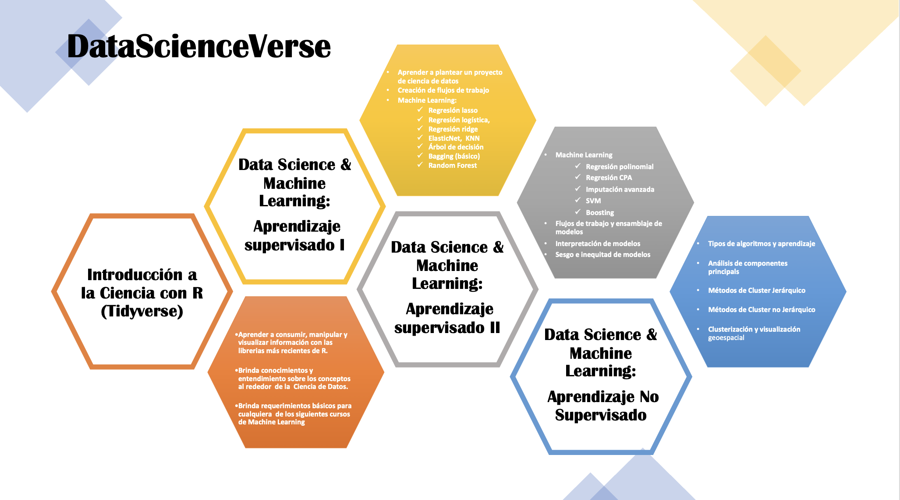
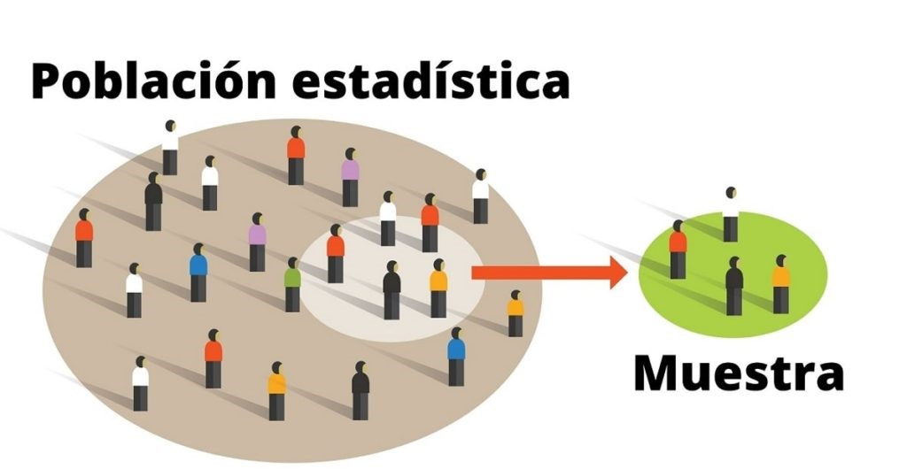
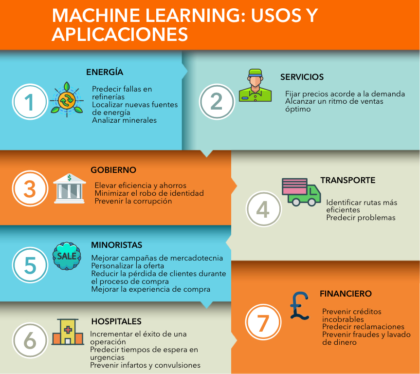
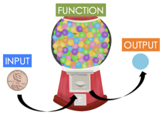
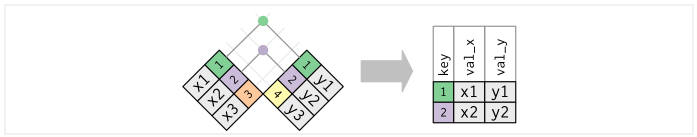
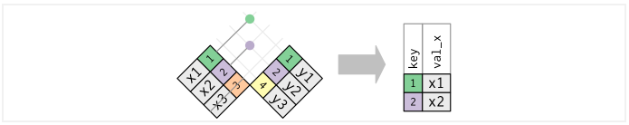
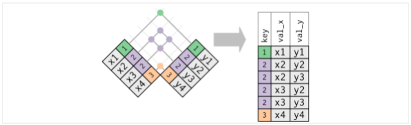
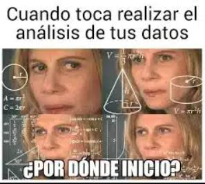
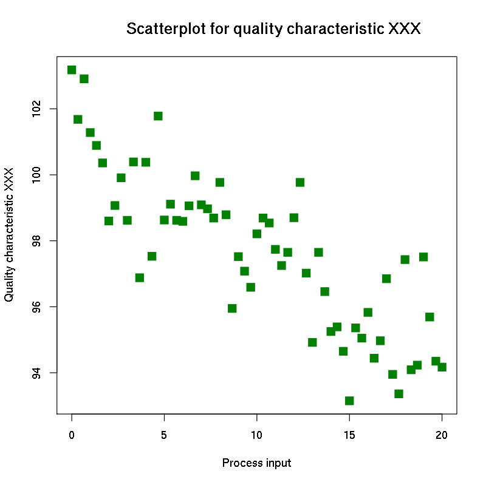

--- 
title: Introducción a Ciencia de Datos con R (Tidyverse)
author:
  - Karina Lizette Gamboa Puente
  - Oscar Arturo Bringas López
institute: "AMAT"
site: bookdown::bookdown_site
documentclass: book
bibliography: [book.bib, packages.bib]
biblio-style: apalike
link-citations: yes
description: "Curso de aprendizaje de programación de R para Ciencia de Datos con Tidyverse"
always_allow_html: true

---


# BIENVENIDA 

## Objetivo

Brindar al participante los elementos teóricos y prácticos básicos alrededor de la Ciencia de Datos. Aprenderá a distinguir las diferentes soluciones a problemas que pueden resolverse con algoritmos de machine learning y aprenderá a usar el conjunto de librerías en *R* más novedoso, estructurado y ampliamente usado para la manipulación, transformación y visualización de datos: *"TIDYVERSE"*. 


## ¿Quienes somos? 

**ACT. ARTURO BRINGAS** 

[LinkedIn](https://www.linkedin.com/in/arturo-bringas/)
Email: act.arturo.b@ciencias.unam.mx

Actuario, egresado de la Facultad de Ciencias y Maestría en Ciencia de Datos, ITAM. 
Experiencia en modelos predictivos y de clasificación de machine learning aplicado a seguros, deportes y movilidad internacional. Jefe de departamento en Investigación Aplicada y Opinión de la UNAM, donde realiza estudios estadísticos de percepción social. Consultor para empresas y organizaciones como UNODC, GNP, CBX, El Universal, INEGI, UNAM, IZZI. Actualmente se desempeña en diferentes proyectos en consultorías como Sinnia, Geek-end y DDI contribuyendo a empresas en temas de ciencia de datos, estadística, visualización de datos y análisis geoespacial.


```{r echo=FALSE,fig.align='center'}

```


**ACT. LIZETTE GAMBOA** 

[LinkedIn](https://www.linkedin.com/in/kalizzygam/)
Email: lizzygamboa@ciencias.unam.mx

Actuaria, egresada de la Facultad de Ciencias, UNAM, Maestría en Ciencia de Datos, ITAM. Experiencia en áreas de analítica predictiva e inteligencia del negocio. Lead y Senior Data Scientist en consultoría en diferentes proyectos con empresas de tecnología, retail y del sector asegurador, financiero y bancario. Experta en entendimiento de negocio para la correcta implementación de algoritmos de inteligencia y explotación de datos. Actualmente se desarrolla como Analytics Architect en Merama, Senior Data Science en CLOSTER y profesora de cursos de ciencia de datos en AMAT.
Empresas anteriores: GNP, Activer Banco y Casa de Bolsa, PlayCity Casinos, RakenDataGroup Consulting, entre otros.

```{r echo=FALSE,fig.align='center'}
knitr::include_graphics("img/00-presentacion/lizzy.png")
```

## Ciencia de Datos en R

```{r echo=FALSE,fig.align='center'}

```
 


## Estructura del curso actual

### Alcances del curso

Al finalizar este curso el participante será capaz de consumir, manipular y visualizar información proveniente de diversas fuentes de información para resolver problemas de propósito general asociados a los datos. Este curso brindará las bases para introducirse a cualquiera de los cursos de Ciencia de datos que se imparten en AMAT: 

1. Data Science & Machine Learning (Aprendizaje supervisado I)

2. Data Science & Machine Learning (Aprendizaje no supervisado)

Requisitos: Computadora con al menos 4Gb Ram 

**Temario:**

**1. Introducción a Ciencia de Datos**

* ¿Qué es Ciencia de Datos?
* Objetivo de la ciencia de datos
* ¿Qué se requiere para hacer ciencia de datos?
* Tipos de problemas que se pueden resolver 
* Tipos de algoritmos y aprendizaje


**2. Transformación y manipulación de estructuras de datos**

* Importación
* Lectura 
* Consultas 
* Transformación de estructura


**3. Manipulación de texto**

* Concatenación
* Expresiones regulares
* Extracción


**4.  Manipulación de fechas y horas**

* Creación de datos temporales
* Transformación de datos temporales
* Operaciones con datos temporales


**5. Análisis exploratorio y visualización interactiva de datos**

* EDA
* GEDA
* Uso, decisión e implementación de técnicas gráficas
* Visualización interactiva

## Duración y evaluación del curso

* El programa tiene una duración de 24 hrs.

* Las clases serán impartidas los días sábado, de 9:00 am a 1:00 pm 

* Serán asignados ejercicios que el participante deberá resolver entre una semana y otra.

* Al final del curso se solicitará un proyecto final, el cual deberá ser entregado para ser acreedor a la constancia de participación.


## Recursos y dinámica de clase

En esta clase estaremos usando: 

* R [da click aquí si aún no lo descargas](https://cran.r-project.org/)
* RStudio [da click aquí también](https://www.rstudio.com/products/rstudio/download/)
* Miro [úsame](https://miro.com/welcomeonboard/WXJiSGtOUnE4Mm1EQnJaQWxIR2R6RGxPaVo5eXQ3bG1SMHNWSkVIZ09YQ3JlTHRma1dYcFJzbm9wZ05OVmxVMXwzMDc0NDU3MzU1MzI0OTQwMDI5?invite_link_id=632956861297)
* Zoom [Clases](https://us02web.zoom.us/j/5155440751?pwd=YzJCOGF0VnlZdlZlS0Fpc3MvZEhadz09)
  - Pulgar arriba: Voy bien, estoy entendiendo! 
  - Pulgar abajo: Eso no quedó muy claro
  - Mano arriba: Quiero participar/preguntar ó Ya estoy listo para iniciar 
* Grupo de WhatsApp [El chismecito está aquí](https://chat.whatsapp.com/CNv5RxZb7FnLbzUFHGtYMG)
* [Google Drive](https://drive.google.com/drive/u/1/folders/16aKNbkhYfF-x6R2oh4RswSQOXN62UQX3)
* Notas de clase [Revisame si quieres aprender](KaLizzyGam.github.io/index.html) 


 


<div class="watermark"></div>


<!--chapter:end:index.Rmd-->

# Introducción a Ciencia de Datos

## ¿Qué es Ciencia de Datos?

### Definiendo conceptos:

**Estadistica** Disciplina que recolecta, organiza, analiza e interpreta datos. Lo hace a través de una población muestral generando estadística descriptiva y estadística inferencial.

-   Estadística descriptiva: Describe de manera cuantificada información de los datos: distribuciones de los datos, análisis exploratorio, correlaciones, outliers, etc.
-   Estadística inferencial: A partir de los datos de una población muestral, deducir / concluir / analizar hipótesis para una población.
-   Principales tipos de problemas: Todo lo que tenga datos - tener muchos datos, puede llegar a ser un problema -.
-   La estadística supone *casi siempre* que el sistema es estático y generaliza la solución bajo las mismas condiciones.
-   Si la cantidad de datos es de "gran escala", es muy probable que se tengan que hacer muestras para trabajar con los datos.

```{r echo=FALSE,fig.align='center'}

```

-   **Business Intelligence**: BI aprovecha el software y los servicios para transformar los datos en conocimientos prácticos que informan las decisiones empresariales estratégicas y tácticas de una organización. Las herramientas de BI acceden y analizan conjuntos de datos y presentan hallazgos analíticos en informes, resúmenes, tableros, gráficos, cuadros, -indicadores- o KPI's y mapas para proporcionar a los usuarios inteligencia detallada sobre el estado del negocio. (BI esta enfocado en analizar la historia pasada)

```{r echo=FALSE,fig.align='center'}
knitr::include_graphics("img/01-intro/04_bi.png")
```

-   **Machine Learning**: El 'machine learning' --aprendizaje automático-- es una rama de la inteligencia artificial que permite que las máquinas aprendan de los patrones existentes en los datos. Se usan métodos computacionales para aprender de datos con el fin de producir reglas para mejorar el desempeño en alguna tarea o toma de decisión. (Está enfocado en la programación de máquinas para aprender de los patrones existentes en datos principalmente estructurados y anticiparse al futuro)

```{r echo=FALSE,fig.align='center', out.width='600pt'}
knitr::include_graphics("img/01-intro/02_ml.png")
```

```{r echo=FALSE,fig.align='center'}
knitr::include_graphics("img/01-intro/03_supervisado_robo.png")
```

-   **Deep Learning**: El aprendizaje profundo es un subcampo del aprendizaje automático que se ocupa de los algoritmos inspirados en la estructura y función del cerebro llamados redes neuronales artificiales.

    En *Deep Learning*, un modelo de computadora aprende a realizar tareas de clasificación directamente a partir de imágenes, texto o sonido. Los modelos de aprendizaje profundo pueden lograr una precisión de vanguardia, a veces superando el rendimiento a nivel humano. Los modelos se entrenan mediante el uso de un gran conjunto de datos etiquetados y arquitecturas de redes neuronales que contienen muchas capas. (Está enfocado en la programación de máquinas para el reconocimiento de imagenes y audio (datos no estructurados))

```{r echo=FALSE,fig.align='center'}
knitr::include_graphics("img/01-intro/05_reconocimiento.png")
```

```{r echo=FALSE,fig.align='center'}
knitr::include_graphics("img/01-intro/06_ml1.png")
```

-   **Big data** se refiere a los grandes y diversos conjuntos de información que crecen a un ritmo cada vez mayor. Abarca el volumen de información, la velocidad a la que se crea y recopila, y la variedad o alcance de los puntos de datos que se cubren. Los macrodatos a menudo provienen de la minería de datos y llegan en múltiples formatos.

    Es comun que se confunda los conceptos de *Big Data* y *Big Compute*, como habiamos mencionado *Big Data* se refiere a el procesamiento de conjuntos de datos que son más voluminosos y complejos que los tradicionales y *Big Compute* a herramientas y enfoques que utilizan una gran cantidad de recursos de CPU y memoria de forma coordinada para resolver problemas que usan algoritmos muy complejos.

```{r echo=FALSE,fig.align='center', out.width='600pt'}
knitr::include_graphics("img/01-intro/07_bigdata.jpg")
```

Curiosidad: [Servidores en líquido para ser enfriados](https://www.xatakawindows.com/actualidad-en-redmond/servidores-liquido-hirviendo-esta-idea-microsoft-para-evitar-calentamiento-sus-equipos#:~:text=Con%20este%20sistema%2C%20el%20dispositivo,fr%C3%ADo%2C%20emplea%20uno%20en%20ebullici%C3%B3n.)

Curiosidad 2: [Centro de datos en el océano](https://www.bbc.com/mundo/noticias/2016/02/160202_microsoft_centro_datos_debajo_agua_mar_subamino_all)

</br> **Entonces, ¿qué NO es ciencia de datos?**

-   No es una tecnología
-   No es una herramienta
-   No es desarrollo de software
-   No es Business Intelligence\*
-   No es Big Data\*
-   No es Inteligencia Artificial\*
-   No es (solo) machine learning
-   No es (solo) deep learning
-   No es (solo) visualización
-   No es (solo) hacer modelos

## Objetivo de la Ciencia de Datos

-   **Ciencia de datos**: Los científicos de datos analizan qué preguntas necesitan respuesta y dónde encontrar los datos relacionados. Tienen conocimiento de negocio y habilidades analíticas, así como la capacidad de extraer, limpiar y presentar datos. Las empresas utilizan científicos de datos para obtener, administrar y analizar grandes cantidades de datos no estructurados. Luego, los resultados se sintetizan y comunican a las partes interesadas clave para impulsar la toma de decisiones estratégicas en la organización.

```{r echo=FALSE,fig.align='center', out.height='500pt', out.width='600pt'}
knitr::include_graphics("img/01-intro/08_data_science_vd.png")
```

Fuente: [Blog post de Drew Conway](http://drewconway.com/zia/2013/3/26/the-data-science-venn-diagram)

Más sobre Conway: [Forbes 2016](https://www.forbes.com/sites/joshwolfe/2016/03/03/using-data-science-for-the-physical-world/?sh=614ac5b0150e)

## ¿Qué se requiere para hacer Ciencia de Datos?

-   Background científico

    -   Conocimientos generales de probabilidad, estadística, álgebra lineal, cálculo, geometría análitica, programación, conocimientos computacionales... etc

-   Datos

    -   Relevancia y suficiencia

    Es indispensable saber si los datos con los que se trabajará son relevantes y suficientes, debemos evaluar qué preguntas podemos responder con los datos con los que contamos.

    -   Suficiencia: Los datos con los que trabajamos tienen que ser representativos de la población en general, necesitamos que las características representadas en la información sean suficientes para aproximar a la población objetivo.

    -   Relevancia: De igual manera los datos tienen que tener relevancia para la tarea que queremos resolver, por ejemplo, es probable que información sobre gusto en alimentos sea irrelevante para predecir número de hijos.

```{r echo=FALSE,fig.align='center'}
knitr::include_graphics("img/01-intro/09_relevancia_suficiencia.png")
```

-   Etiquetas

    -   Se necesita la intervención humana para etiquetar, clasificar e introducir los datos en el algoritmo.

```{r echo=FALSE,fig.align='center', out.height='300pt', out.width='600pt'}
knitr::include_graphics("img/01-intro/10_etiquetas.png")
```

-   Software

    -   Existen distintos lenguajes de programación para realizar ciencia de datos:

```{r echo=FALSE,fig.align='center', out.height='300pt', out.width='600pt'}

```

## Aplicaciones de Ciencia de Datos

Dependiendo de la industria en la que se quiera aplicar Machine Learning, podemos pensar en distintos enfoques, en la siguiente imagen se muestran algunos ejemplos:

```{r echo=FALSE, fig.align='center', out.height='750pt', out.width='800pt'}

```

Podemos pensar en una infinidad de aplicaciones comerciales basadas en el análisis de datos. Con la intención de estructurar las posibles aplicaciones, se ofrece a contiuación una categorización que, aunque no es suficiente para englobar todos los posibles casos de uso, sí es sorprendente la cantidad de aplicaciones que abarca.

**1. Aplicaciones centradas en los clientes**

-   Incrementar beneficio al mejorar recomendaciones de productos
-   Upselling
-   Cross-selling
-   Reducir tasas de cancelación y mejorar tasas de retención
-   Personalizar experiencia de usuario
-   Mejorar el marketing dirigido
-   Análisis de sentimientos
-   Personalización de productos o servicios

**2. Optimización de problemas**

-   Optimización de precios
-   Ubicación de nuevas sucursales
-   Maximización de ganancias mediante producción de materias primas
-   Construcción de portafolios de inversión

**3. Predicción de demanda**

-   Número futuro de clientes
-   Número esperado de viajes en avión / camión / bicis
-   Número de contagios por un virus (demanda médica / medicamentos / etc)
-   Predicción de uso de recursos (luz / agua / gas)

**4. Análisis de detección de fraudes**

-   Detección de robo de identidad
-   Detección de transacciones ilícitas
-   Detección de servicios fraudulentos
-   Detección de zonas geográficas con actividades ilícitas

## Tipos de aprendizaje

La diferencia entre el análisis supervisado y el no supervisado es la etiqueta, es decir, en el análisis supervisado tenemos una etiqueta "correcta" y el objetivo de los algoritmos es predecir esta etiqueta.

### Aprendizaje supervisado

-   Conocemos la respuesta correcta de antemano.

-   Esta respuesta correcta fue "etiquetada" por un humano (la mayoría de las veces, en algunas circunstancias puede ser generada por otro algoritmo).

-   Debido a que conocemos la respuesta correcta, existen muchas métricas de desempeño del modelo para verificar que nuestro algoritmo está haciendo las cosas "bien".

#### Tipos de aprendizaje supervisado (Regresión vs clasificación)

Existen dos tipos principales de aprendizaje supervisado, esto depende del tipo de la variable respuesta:

-   Los algoritmos de **clasificación** se usan cuando el resultado deseado es una etiqueta discreta, es decir, clasifican un elemento dentro de diversas clases.

-   En un problema de **regresión**, la variable target o variable a predecir es un valor numérico.

<br/>

```{r echo=FALSE,fig.align='center', out.height='450pt', out.width='700pt'}
knitr::include_graphics("img/01-intro/13_regresion_clasificacion.png")
```

### Aprendizaje no supervisado

-   Aquí no tenemos la respuesta correcta de antemano ¿cómo podemos saber que el algoritmo está bien o mal?

-   Estadísticamente podemos verificar que el algoritmo está bien

-   Siempre tenemos que verificar con el cliente si los resultados que estamos obteniendo tienen sentido de negocio. Por ejemplo, número de grupos y características

```{r echo=FALSE,fig.align='center'}
knitr::include_graphics("img/01-intro/14_nosupervisado_robo.png")
```

# R

R (R Core Team 2018) es un entorno y lenguaje de programación que permite el análisis estadístico de información y reportes gráficos. Es ampliamente usado en investigación por la comunidad estadística en campos como la biomedicina, minería de datos, matemáticas financieras, entre otros. Ha ganado mucha popularidad en los últimos años al ser un software libre que está en constante crecimiento por las aportaciones de otros usuarios y que permite la interacción con software estadísticos como STATA, SAS, SPSS, etc.. R permite la incorporación de librerías y paqueterías con funcionalidades específicas, por lo que es un lenguaje de programación muy completo y fácil de usar.

## ¿Cómo obtener *R*?

R puede ser fácilmente descargado de forma gratuita desde el sitio oficial <http://www.r-project.org/>. R está disponible para las plataformas Windows, Mac y Linux.

## ¿Qué es RStudio?

*RStudio* es un Entorno de Desarrollo Integrado (IDE, por sus siglas en inglés) para R. Este permite y facilita el desarrollo y ejecución de sintaxis para código en *R*, incluye una consola y proporciona herramientas para la gestión del espacio de trabajo. *RStudio* está disponible para Windows, Mac y Linux o para navegadores conectados a RStudio Server o RStudio Server Pro.

Algunas de las principales características de Rstudio que lo hacen una gran herramienta para trabajar en R, son:

-   Auto completado de código
-   Sangría inteligente
-   Resaltado de sintaxis
-   Facilidad para definir funciones
-   Soporte integrado
-   Documentación integrada
-   Administración de directorios y proyectos
-   Visor de datos
-   Depurador interactivo para corregir errores
-   Conección con Rmarkwon y Sweave

La siguiente imagen muestra la forma en la que está estructurado RStudio. El orden de los páneles puede ser elegido por el usuario, así como las características de tipo de letra, tamaño y color de fondo, entre otras características.

```{r, echo = F, out.width = "800px", out.height="450px", fig.align = "center", fig.cap= "Páneles de trabajo de Rstudio"}
knitr::include_graphics("img/01-intro/15_rstudio3.png")
```

## *R* como lenguaje orientado a objetos

*R* es un lenguaje de programación orientado a objetos (POO). (López 2011, pag. 5) define a los objetos y sus características como "cualquier cosa con significado para el problema que se trata de resolver". A partir de esa definición, se puede decir que sirve para representar alguna entidad de la vida real, por lo general son componentes del problema que se pretende resolver y con los que podemos interactuar. A través de esta interacción y del estudio que se haga de ellos, es posible clasificarlos en grupos de acuerdo a sus caractrerísticas. A partir de los objetos con los que se trabaje, surgirán las clases adecuadas para encontrar la solución a un problema dado.

Los objetos tienen características fundamentales que permiten identificarlos, conocerlos y entender su comportamiento. De acuerdo con (Schildt 2009), estas características son:

1.  Identidad
2.  Comportamiento
3.  Estructura

-   **Identidad:** Esta es la propiedad que da nombre a cada uno de los objetos y que permite declararlos, distinguirlos de manera única, usarlos y llamarlos para la representación de su contenido.

-   **Comportamiento:** Esta es la propiedad que determina las operaciones que puede realizar el objeto, es decir, permite conocer las capacidades y alcances de la funcionalidad de cada objeto. El comportamiento permite conocer la interacción que puede existir con otros objetos y los resultrados que generarán.

-   **Estructura:** El estado se refiere a un conjunto de características o atributos específicos del objeto dados en un momento determinado, y que pueden cambiar en un instante de tiempo.

En la programación orientada a objetos, un programa recolecta muchos objetos para ser tratado como un conjunto dinámico de objetos interactuando entre sí. Los objetos están definidos por:

1.  **Atributos:** Son las propiedades o características de los datos contenidos en un objeto. Los valores asociados a un objeto en un momento determinado del tiempo determinan su estado.

2.  **Métodos:** Acceden a los atributos de los objetos y determinan el comportamiento de los datos contenidos.

# Tipos de variables

---
Para este capítulo usaremos las notas de 'fhernanb': [Manual de R](https://fhernanb.github.io/Manual-de-R/intro.html)
---

En R existen varios tipos de objectos que permiten que el usuario pueda almacenar la información para realizar procedimientos estadísticos y gráficos. Los principales objetos en R son vectores, matrices, arreglos, marcos de datos y listas. A continuación se presentan las características de estos objetos y la forma para crearlos.

## Variables

Las variables sirven para almacenar un valor que luego vamos a utilizar en algún procedimiento.

Para hacer la asignación de un valor a alguna variable se utiliza el operador \<- entre el valor y el nombre de la variable. A continuación un ejemplo sencillo.

```{r}
x <- 5
2 * x + 3
```

En el siguiente ejemplo se crea la variable pais y se almacena el nombre Colombia, luego se averigua el número de caracteres de la variable pais.

```{r}
pais <- "Colombia"
nchar(pais)
```

## Vectores

Los vectores vectores son arreglos ordenados en los cuales se puede almacenar información de tipo numérico (variable cuantitativa), alfanumérico (variable cualitativa) o lógico (TRUE o FALSE), pero no mezclas de éstos. La función de R para crear un vector es c() y que significa concatenar; dentro de los paréntesis de esta función se ubica la información a almacenar. Una vez construído el vector se acostumbra a etiquetarlo con un nombre corto y representativo de la información que almacena, la asignación se hace por medio del operador \<- entre el nombre y el vector.

A continuación se presenta un ejemplo de cómo crear tres vectores que contienen las respuestas de cinco personas a tres preguntas que se les realizaron.

```{r}

edad <- c(15, 19, 13, NA, 20)
deporte <- c(TRUE, TRUE, NA, FALSE, TRUE)
comic_fav <- c(NA, 'Superman', 'Batman', NA, 'Batman')
```

El vector edad es un vector cuantitativo y contiene las edades de las 5 personas. En la cuarta posición del vector se colocó el símbolo NA que significa *Not Available* debido a que no se registró la edad para esa persona. Al hacer una asignación se acostumbra a dejar un espacio antes y después del operador \<- de asignación. El segundo vector es llamado deporte y es un vector lógico que almacena las respuestas a la pregunta de si la persona practica deporte, nuevamente aquí hay un NA para la tercera persona. El último vector comic_fav contiene la información del cómic favorito de cada persona, como esta variable es cualitativa es necesario usar las comillas ' ' para encerrar las respuestas.

---
Cuando se usa NA para representar una información Not Available no se deben usar comillas.
---

---
Es posible usar comillas sencillas 'foo' o comillas dobles "foo" para ingresar valores de una variable cualitativa.
---

Si se desea ver lo que está almacenado en cada uno de estos vectores, se debe escribir en la consola de R el nombre de uno de los objetos y luego se presiona la tecla enter o intro, al realizar esto lo que se obtiene se muestra a continuación.

```{r}
edad 
```

```{r}
deporte 
```

```{r}
comic_fav 
```

---
Una variable es un vector de longitud uno.
---

### Cómo extraer elementos de un vector?

Para extraer un elemento almacenado dentro un vector se usan los corchetes \[\] y dentro de ellos la posición o posiciones que interesan.

Ejemplo Si queremos extraer la edad de la tercera persona escribimos el nombre del vector y luego \[3\] para indicar la tercera posición de edad, a continuación el código.

```{r}
edad[3]

```

Si queremos conocer el cómic favorito de la segunda y quinta persona, escribimos el nombre del vector y luego, dentro de los corchetes, escribimos otro vector con las posiciones 2 y 5 que nos interesan así \[c(2, 5)\], a continuación el código.

```{r}
comic_fav[c(2, 5)]

```

Si nos interesan las respuestas de la práctica de deporte, excepto la de la persona 3, usamos \[-3\] luego del nombre del vector para obtener todo, excepto la tercera posición.

```{r}
deporte[-3]

```

---
Si desea extraer varios posiciones de un vector NUNCA escriba esto: mivector[2, 5, 7]. Tiene que crear un vector con las posiciones y luego colocarlo dentro de los corchetes así: mivector[c(2, 5, 7)]
---


## Matrices


Las matrices son arreglos rectangulares de filas y columnas con información numérica, alfanumérica o lógica. Para construir una matriz se usa la función matrix( ). Por ejemplo, para crear una matriz de 4 filas y 5 columnas (de dimensión  4×5) con los primeros 20 números positivos se escribe el código siguiente en la consola.

``` {r}
mimatriz <- matrix(data=1:20, nrow=4, ncol=5, byrow=FALSE)
```

El argumento data de la función sirve para indicar los datos que se van a almacenar en la matriz, los argumentos nrow y ncol sirven para definir la dimensión de la matriz y por último el argumento byrow sirve para indicar si la información contenida en data se debe ingresar por filas o no. Para observar lo que quedó almacenado en el objeto mimatriz se escribe en la consola el nombre del objeto seguido de la tecla enter o intro.

``` {r}
mimatriz
```

###  ¿Cómo extraer elementos de una matriz?


Al igual que en el caso de los vectores, para extraer elementos almacenados dentro de una matriz se usan los corchetes [ , ] y dentro, separado por una coma, el número de fila(s) y el número de columna(s) que nos interesan.

**Ejemplo**

Si queremos extraer el valor almacenado en la fila 3 y columna 4 usamos el siguiente código.

``` {r}
mimatriz[3, 4]
```

Si queremos recuperar *toda* la fila 2 usamos el siguiente código.

``` {r}
mimatriz[2, ]  # No se escribe nada luego de la coma
```


Si queremos recuperar *toda* la columna 5 usamos el siguiente código.

``` {r}
mimatriz[, 5]  # No se escribe nada antes de la coma
```

Si queremos recuperar la matriz original sin las columnas 2 y 4 usamos el siguiente código.

``` {r}
mimatriz[, -c(2, 4)]  # Las columnas como vector
```


Si queremos recuperar la matriz original sin la fila 1 ni columna 3 usamos el siguiente código.

``` {r}
mimatriz[-1, -3]  # Signo de menos para eliminar
```

##  Arreglos 

Un arreglo es una matriz de varias dimensiones con información numérica, alfanumérica o lógica. Para construir una arreglo se usa la función array( ). Por ejemplo, para crear un arreglo de  3 × 4 × 2 con las primeras 24 letras minúsculas del alfabeto se escribe el siguiente código.

``` {r}
miarray <- array(data=letters[1:24], dim=c(3, 4, 2))
```

El argumento data de la función sirve para indicar los datos que se van a almacenar en el arreglo y el argumento dim sirve para indicar las dimensiones del arreglo. Para observar lo que quedó almacenado en el objeto miarray se escribe en la consola lo siguiente.

``` {r}
miarray
```


### ¿Cómo extraer elementos de un arreglo?
Para recuperar elementos almacenados en un arreglo se usan también corchetes, y dentro de los corchetes, las coordenadas del objeto de interés.


**Ejemplo**
Si queremos extraer la letra almacenada en la fila 1 y columna 3 de la segunda capa de miarray usamos el siguiente código.

``` {r}
miarray[1, 3, 2]  # El orden es importante
```


Si queremos extraer la segunda capa completa usamos el siguiente código.

``` {r}
miarray[,, 2]  # No se coloca nada en las primeras posiciones
```

Si queremos extraer la tercera columna de todas las capas usamos el siguiente código.

``` {r}
miarray[, 3,]  # No se coloca nada en las primeras posiciones
```

## Data Frames  
El marco de datos marco de datos o data frame es uno de los objetos más utilizados porque permite agrupar vectores con información de diferente tipo (numérica, alfanumérica o lógica) en un mismo objeto, la única restricción es que los vectores deben tener la misma longitud. Para crear un marco de datos se usa la función data.frame( ), como ejemplo vamos a crear un marco de datos con los vectores edad, deporte y comic_fav definidos anteriormente.


``` {r}
mi_data_frame <- data.frame(edad, deporte, comic_fav) # No se coloca nada en las primeras posiciones
```


Una vez creado el objeto mi_data_frame podemos ver el objeto escribiendo su nombre en la consola, a continuación se muestra lo que se obtiene.


``` {r}
mi_data_frame 
```

De la salida anterior vemos que el marco de datos tiene 3 variables (columnas) cuyos nombres coinciden con los nombres de los vectores creados anteriormente, los números consecutivos al lado izquierdo son sólo de referencia y permiten identificar la información para cada persona en la base de datos.


### ¿Cómo extraer elementos de un data frame?
Para recuperar las variables (columnas) almacenadas en un marco de datos se puede usar el operador $, corchetes simples $$[]$$ o corchetes dobles $$[[]]$$. A continuación algunos ejemplos para entender las diferencias entre estas opciones.

**Ejemplo**
Si queremos extraer la variable deporte del marco de datos mi_data_frame como un vector usamos el siguiente código.


``` {r}
mi_data_frame$deporte  # Se recomienda si el nombre es corto
```


Otra forma de recuperar la variable deporte como vector es indicando el número de la columna donde se encuentra la variable.

``` {r}
mi_data_frame[, 2]  # Se recomienda si recordamos su ubicacion
```

Otra forma de extraer la variable deporte como vector es usando [[]] y dentro el nombre de la variable.

``` {r}
mi_data_frame[["deporte"]]
```

Si usamos mi_data_frame["deporte"] el resultado es la variable deporte pero en forma de marco de datos, no en forma vectorial.

``` {r}
mi_data_frame["deporte"]
```

Si queremos extraer un marco de datos sólo con las variables deporte y edad podemos usar el siguiente código.

``` {r}
mi_data_frame[c("deporte", "edad")]
```


Por otra, si queremos la edad de las personas que están en las posiciones 2 hasta 4 usamos el siguiente código.

``` {r}
mi_data_frame[2:4, 1]
```


###¿Cómo extraer subconjuntos de un data frame? 
Para extraer partes de un marco de datos se puede utilizar la función subset(x, subset, select). El parámetro x sirve para indicar el marco de datos original, el parámetro subset sirve para colocar la condición y el parámetro select sirve para quedarnos sólo con algunas de las variabl es del marco de datos. A continuación varios ejemplos de la función subset para ver su utilidad.

Ejemplos
Si queremos el marco de datos mi_data_frame sólo con las personas que SI practican deporte usamos el siguiente código.

``` {r}
subset(mi_data_frame, subset=deporte == TRUE)

```


Si queremos el marco de datos mi_data_frame sólo con las personas mayores o iguales a 17 años usamos el siguiente código.

``` {r}
subset(mi_data_frame, subset=edad >= 17)
```


Si queremos el submarco con deporte y comic de las personas menores de 20 años usamos el siguiente código.

``` {r}
subset(mi_data_frame, subset=edad < 20, select=c('deporte', 'comic_fav'))
```


Si queremos el marco de datos mi_data_frame sólo con las personas menores de 20 años y que SI practican deporte usamos el siguiente código.

``` {r}
subset(mi_data_frame, subset=edad < 20 & deporte == TRUE)
```

**Ejemplo**


Leer la base de datos medidas del cuerpo disponible en este enlace Medidas del cuerpo de [Fhernanb] (https://raw.githubusercontent.com/fhernanb/datos/master/medidas_cuerpo). Extraer de esta base de datos una sub-base o subconjunto que contenga sólo la edad, peso, altura y sexo de aquellos que miden más de 185 cm y pesan más de 80 kg.

``` {r}
url <- 'https://raw.githubusercontent.com/fhernanb/datos/master/medidas_cuerpo'
dt1 <- read.table(url, header=T)
dim(dt1)  # Para conocer la dimensión de la base original

```

``` {r}
dt2 <- subset(x=dt1, subset=altura > 185 & peso > 80,
              select=c('sexo', 'edad', 'peso', 'altura'))
dt2  # Para mostrar la base de datos final

```

Al almacenar la nueva base de datos en el objeto dt2 se puede manipular este nuevo objeto para realizar los análisis de interés.


## Listas


Las listas son otro tipo de objeto muy usado para almacenar objetos de diferente tipo. La instrucción para crear una lista es list( ). A continuación vamos a crear una lista que contiene tres objetos: un vector con 5 números aleatorios llamado mivector, una matriz de dimensión  6×2 con los primeros doce números enteros positivos llamada matriz2 y el tercer objeto será el marco de datos mi_data_frame creado en el apartado anterior. Las instrucciones para crear la lista requerida se muestran a continuación.


``` {r}
set.seed(12345)
mivector <- runif(n=5)
matriz2 <- matrix(data=1:12, ncol=6)
milista <- list(E1=mivector, E2=matriz2, E3=mi_data_frame)
```

La función set.seed de la línea número 1 sirve para fijar la semilla de tal manera que los números aleatorios generados en la segunda línea con la función runif sean siempre los mismos. En la última línea del código anterior se construye la lista, dentro de la función list se colocan los tres objetos mivector, matriz2 y mi_data_frame. Es posible colocarle un nombre especial a cada uno de los elementos de la lista, en este ejemplo se colocaron los nombres E1, E2 y E3 para cada uno de los tres elementos. Para observar lo que quedó almacenado en la lista se escribe milista en la consola y el resultado se muestra a continuación.

``` {r}
milista
```

### ¿Cómo extraer elementos de una lista?
Para recuperar los elementos almacenadas en una lista se usa el operador $, corchetes dobles [[]] o corchetes sencillos []. A continuación unos ejemplos para entender cómo extraer elementos de una lista.

**Ejemplos**
Si queremos la matriz almacenada con el nombre de E2 dentro del objeto milista se puede usar el siguiente código.

``` {r}
milista$E2
```

Es posible indicar la posición del objeto en lugar del nombre, para eso se usan los corchetes dobles.

``` {r}
milista[[2]]
```

El resultado obtenido con milista$E2 y milista[[2]] es exactamente el mismo. Vamos ahora a solicitar la posición 2 pero usando corchetes sencillos.

``` {r}
milista[2]
```

La apariencia de este último resultado es similar, no igual, al encontrado al usar $ y [[]]. Para ver la diferencia vamos a pedir la clase a la que pertenecen los tres últimos objetos usando la función class. A continuación el código usado.

``` {r}
class(milista$E2)
```

``` {r}
class(milista[[2]])
```

``` {r}
class(milista[2])
```

---
De lo anterior se observa claramente que cuando usamos $ o [[]] el resultado es el objeto almacenado, una matriz. Cuando usamos [] el resultado es una lista cuyo contenido es el objeto almacendado.
---


## Ejercicios


1. Use funciones o procedimientos (varias líneas) de R para responder cada una de las siguientes preguntas.

2. Construya un vector con la primeras 20 letras MAYÚSCULAS usando la función LETTERS.

3. Construya una matriz de  10×10 con los primeros 100 números positivos pares.

4. Construya una matriz identidad de dimension  3×3. Recuerde que una matriz identidad tiene sólo unos en la diagonal principal y los demás elementos son cero.

5. Construya una lista con los anteriores tres objetos creados.

6. Construya un marco de datos o data frame con las respuestas de 3 personas a las preguntas: (a) ¿Cuál es su edad en años? (b) ¿Tipo de música que más le gusta? (c) ¿Tiene usted pareja sentimental estable?

7. ¿Cuál es el error al correr el siguiente código? ¿A qué se debe? 


```{r, eval=FALSE}

edad <- c(15, 19, 13, NA, 20)
deporte <- c(TRUE, TRUE, NA, FALSE, TRUE)
comic_fav <- c(NA, 'Superman', 'Batman', NA, 'Batman')
matrix(edad, deporte, comic_fav)

```


# Guía de estilo {#estilo}

Así como en el español existen reglas ortográficas, la escritura de códigos en R también tiene unas reglas que se recomienda seguir para evitar confusiones. Tener una buena guía de estilo es importante para que el código creado por usted sea fácilmente entendido por sus lectores [@rpackages]. No existe una única y mejor guía de estilo para escritura en R, sin embargo aquí vamos a mostrar unas sugerencias basadas en la guía llamada [The tidyverse style guidee](https://style.tidyverse.org/).

## Nombres de los archivos
Se sugiere que el nombre usado para nombrar un archivo tenga sentido y que termine con extensión ".R". A continuación dos ejemplos de como nombrar bien y mal un archivo.

- Bien: `"2020-analisis_pca.R`
- Mal: `ju89HR56_74.R`

## Nombres de los objetos
Se recomienda usar los símbolos `_` dentro de los nombres de objetos. 

- Para las variables es preferible usar letras minúsculas (`pesomaiz` o `peso_maiz`) o utilizar la notación camello iniciando en minúscula (`pesoMaiz`). 
- Para las funciones se recomienda usar la notación camello iniciando todas la palabras en mayúscula (`PlotRes`). 
- Para los nombres de las constantes se recomienda que inicien con la letra k (`kPrecioBus`).

## Longitud de una línea de código
Se recomienda que cada línea tenga como máximo 80 caracteres. Si una línea es muy larga se debe cortar siempre por una coma.

## Espacios
Use espacios alrededor de todos los operadores binarios (=, +, -, <-, etc.). Los espacios alrededor del símbolo `=` son opcionales cuando se usan para ingresar valores dentro de una función. Así como en español, nunca coloque espacio antes de una coma, pero siempre use espacio luego de una coma. A continuación ejemplos de buenas y malas prácticas.

```{r, eval=F}
tab <- table(df[df$days < 0, 2])  # Bien
tot <- sum(x[, 1])                # Bien
tot <- sum(x[1, ])                # Bien
tab <- table(df[df$days<0, 2])    # Faltan espacios alrededor '<' 
tab <- table(df[df$days < 0,2])   # Falta espacio luego de coma
tab <- table(df[df$days < 0 , 2]) # Sobra espacio antes de coma
tab<- table(df[df$days < 0, 2])   # Falta espacio antes de '<-'
tab<-table(df[df$days < 0, 2])    # Falta espacio alrededor de '<-'
tot <- sum(x[,1])                 # Falta espacio luego de coma
tot <- sum(x[1,])                 # Falta espacio luego de coma
```

Otra buena práctica es colocar espacio antes de un paréntesis excepto cuando se llama una función.

```{r, eval=F}
if (debug)    # Correcto
if(debug)     # Funciona pero no se recomienda
colMeans (x)  # Funciona pero no se recomienda
```

Espacios extras pueden ser usados si con esto se mejora la apariencia del código, ver el ejemplo siguiente.

```{r, eval=F}
plot(x    = x.coord,
     y    = data.mat[, MakeColName(metric, ptiles[1], "roiOpt")],
     ylim = ylim,
     xlab = "dates",
     ylab = metric,
     main = (paste(metric, " for 3 samples ", sep = "")))
```

No coloque espacios alrededor del código que esté dentro de paréntesis `( )` o corchetes `[ ]`, la única excepción es luego de una coma, ver el ejemplo siguiente.

```{r, eval=F}
if (condicion)    # Correcto 
x[1, ]            # Correcto
if ( condicion )  # Sobran espacios alrededor de condicion
x[1,]             # Se necesita espacio luego de coma
```

Los signos de agrupación llaves `{ }` se utilizan para agrupar bloques de código y se recomienda que nunca una llave abierta `{` esté sola en una línea; una llave cerrada `}` si debe ir sola en su propia línea. Se pueden omitir las llaves cuando el bloque de instrucciones esté formado por una sola línea pero esa línea de código NO debe ir en la misma línea de la condición. A continuación dos ejemplos de lo que se recomienda.

```{r, eval=F}
if (is.null(ylim)) {                     # Correcto
  ylim <- c(0, 0.06)
}
if (is.null(ylim))                       # Correcto
  ylim <- c(0, 0.06)
if (is.null(ylim)) ylim <- c(0, 0.06)    # Aceptable
if (is.null(ylim))                       # No se recomienda
{        
  ylim <- c(0, 0.06)
}
	
if (is.null(ylim)) {ylim <- c(0, 0.06)}
# Frente a la llave { no debe ir nada
# la llave de cierre } debe ir sola
```

La sentencia else debe ir siempre entre llaves `} {`, ver el siguiente ejemplo.

```{r, eval=F}
if (condition) {         
  one or more lines
} else {                 # Correcto
  one or more lines
}
if (condition) {         
  one or more lines
}
else {                   # Incorrecto
  one or more lines
}
if (condition)           
  one line
else                     # Incorrecto
  one line
```

## Asignación

Para realizar asignaciones se recomienda usar el símbolo `<-`, el símbolo de igualdad `=` no se recomienda usarlo para asignaciones.

```{r, eval=F}
x <- 5  # Correcto
x = 5   # No recomendado
```

Para una explicación más detallada sobre el símbolo de asignación se recomienda visitar este [enlace](http://www.win-vector.com/blog/2016/12/the-case-for-using-in-r/).

## Punto y coma
No se recomienda colocar varias instrucciones separadas por `;` en la misma línea, aunque funciona dificulta la revisión del código.

```{r, eval=F}
n <- 100; y <- rnorm(n, mean=5); hist(y)  # No se recomienda
n <- 100                                  # Correcto
y <- rnorm(n, mean=5)
hist(y)
```


A pesar de la anterior advertencia es posible que en este libro usemos el `;` en algunas ocasiones, si lo hacemos es para ahorrar espacio en la presentación del código.


# Funciones básicas de R {#funbas}

En este capítulo se presentará lo que es una función y se mostrarán varias funciones básicas que son útiles para realizar diversas tareas.

## ¿Qué es una función de R?
En la figura de abajo se muestra una ilustración de lo que es una función o máquina general. Hay unas entradas (_inputs_) que luego son procesadas dentro de la caja para generar unas salidas (_outputs_). Un ejemplo de una función o máquina muy común en nuestras casas es la licuadora. Si a una licuadora le ingresamos leche, fresas, azúcar y hielo, el resultado será un delicioso jugo de fresa. 


```{r echo=FALSE,fig.align='center', out.width='600pt' }

```


Las funciones en R se caracterizan por un nombre corto y que dé una idea de lo que hace la función. Los elementos que pueden ingresar (_inputs_) a la función se llaman __parámetros__ o __argumentos__ y se ubican dentro de paréntesis, el cuerpo de la función se ubica dentro de llaves y es ahí donde se procesan los _inputs_ para convertirlos en _outputs_, a continuación se muestra la estructura general de una función.

```{r, eval=F}
nombre_de_funcion(parametro1, parametro2, ...) {
  tareas internas
  tareas internas
  tareas internas
  salida
}
```

Cuando usamos una función sólo debemos escribir bien el nombre e ingresar correctamente los parámetros de la función, el cuerpo de la función ni lo vemos ni lo debemos modificar. A continuación se presenta un ejemplo de cómo usar la función `mean` para calcular un promedio.

```{r}
notas <- c(4.0, 1.3, 3.8, 2.0)  # Notas de un estudiante
mean(notas)
```

## Operadores de asignación
En R se pueden hacer asignación de varias formas, a continuación se presentan los operadores disponibles para tal fin.

- `<-` este es el operador de asignación a izquierda, es el más usado y recomendado.
- `->` este es el operador de asignación a derecha, no es frecuente su uso.
- `=` el símbolo igual sirve para hacer asignaciones pero __NO__ se recomienda usarlo.
- `<<-` este es un operador de asignación global y sólo debe ser usado por usuarios avanzados.

### Ejemplo {-}
Almacene los valores 5.3, 4.6 y 25 en los objetos `a`, `b` y `age` respectivamente, use diferentes símbolos de asignación.

Para hacer lo solicitado se podría usar el siguiente código.

```{r}
a <- 5.3 # Recomended
4.6 -> b # It is not usual
age = 25 # Not recomended
```

```{block2, type='rmdimportant'}
Aunque una asignación se puede hacer de tres formas diferentes, se recomienda sólo usar el símbolo `<-`.
```

## Operaciones básicas
En R se pueden hacer diversas operaciones usando operadores binarios. Este tipo de operadores se denomina binarios porque actuan entre dos objetos, a continuación el listado.

- `+` operador binario para sumar.
- `-` operador binario para restar.
- `*` operador binario para multiplicar.
- `/` operador binario para dividir.
- `^` operador binario para potencia.
- `%/%` operador binario para obtener el cociente en una división (número entero).
- `%%` operador binario para obtener el residuo en una división.


A continuación se presentan ejemplos de cómo usar las anteriores funciones.

```{r}
6 + 4  # Para sumar dos números
a <- c(1, 3, 2)
b <- c(2, 0, 1)  # a y b de la misma dimensión
a + b  # Para sumar los vectores a y b miembro a miembro
a - b  # Para restar dos vectores a y b miembro a miembro
a * b  # Para multiplicar
a / b  # Para dividir
a ^ b  # Para potencia
7 %/% 3  # Para saber las veces que cabe 3 en 7
7 %% 3  # Para saber el residuo al dividir 7 entre 3
```

## Pruebas lógicas
En R se puede verificar si un objeto cumple una condición dada, a continuación el listado de las pruebas usuales.

- `<` para saber si un número es menor que otro.
- `>` para saber si un número es mayor que otro.
- `==` para saber si un número es igual que otro.
- `<=` para saber si un número es menor o igual que otro.
- `>=` para saber si un número es mayor o igual que otro.

A continuación se presentan ejemplos de cómo usar las anteriores funciones.

```{r}
5 < 12  # ¿Será 5 menor que 12?
# Comparando objetos
x <- 5
y <- 20 / 4
x == y  # ¿Será x igual a y?
# Usando vectores
a <- c(1, 3, 2)
b <- c(2, 0, 1)
a > b  # Comparación término a término
a == b  # Comparación de igualdad término a término
```


## Operadores lógicos
En R están disponibles los operadores lógicos negación, conjunción y disyunción. A continuación el listado de los operadores entre los elementos `x` e `y`.

```{r, eval=F}
!x  # Negación de x
x & y  # Conjunción entre x e y
x && y
x | y  # Disyunción entre x e y
x || y
xor(x, y)
```

A continuación se presentan ejemplos de cómo usar el símbolo de negación `!`.

```{r}
ans <- c(TRUE, FALSE, TRUE)
!ans  # Negando las respuestas almacenadas en ans
x <- c(5, 1.5, 2, 3, 2)
!(x < 2.5)  # Negando los resultados de una prueba
```

A continuación se presentan ejemplos de cómo aplicar la conjunción `&` y `&&`.

```{r}
x <- c(5, 1.5, 2)  # Se construyen dos vectores para la prueba
y <- c(4, 6, 3)
x < 4  # ¿Serán los elementos de x menores que 4?
y > 5  # ¿Serán los elementos de y mayores que 5?
x < 4 & y > 5  # Conjunción entre las pruebas anteriores.
x < 4 && y > 5  # Conjunción vectorial
```

Note las diferencias entre los dos últimos ejemplos, cuando se usa `&` se hace una prueba término a término y el resultado es un vector, cuando se usa `&&` se aplica la conjunción al vector de resultados obtenido con `&`.

## Funciones sobre vectores
En R podemos destacar las siguientes funciones básicas sobre vectores numéricos.

- `min`: para obtener el mínimo de un vector.
- `max`: para obtener el máximo de un vector.
- `length`: para determinar la longitud de un vector.
- `range`: para obtener el rango de valores de un vector, entrega el mínimo y máximo.
- `sum`: entrega la suma de todos los elementos del vector.
- `prod`: multiplica todos los elementos del vector.
- `which.min`: nos entrega la posición en donde está el valor mínimo del vector.
- `which.max`: nos da la posición del valor máximo del vector.
- `rev`: invierte un vector.

### Ejemplo {-}
Construir en vector llamado `myvec` con los siguientes elementos: 5, 3, 2, 1, 2, 0, NA, 0, 9, 6. Luego aplicar todas las funciones anteriores para verificar el funcionamiento de las mismas.

```{r}
myvec <- c(5, 3, 2, 1, 2, 0, NA, 0, 9, 6)
myvec
min(myvec)  # Opss, no aparece el mínimo que es Cero.
min(myvec, na.rm=TRUE)  # Usamos na.rm = TRUE para remover el NA
max(myvec, na.rm=T)  # Para obtener el valor máximo
range(myvec, na.rm=T)  # Genera min y max simultáneamente
sum(myvec, na.rm=T)  # La suma de los valores internos
prod(myvec, na.rm=T)  # El productor de los valores internos
which.min(myvec)  # Posición del valor mínimo 0 en el vector
which.max(myvec)  # Posición del valor máximo 9 en el vector
```

De las dos últimas líneas podemos destacar lo siguiente:

1. __NO es necesario__ usar `na.rm = TRUE` para remover el `NA` dentro de las funciones `which.min` ni `which.max`.
2. El valor mínimo 0 aparece en las posicione


## Función `rep`
En R podemos crear repeticiones usando la función `rep`, la estructura de esta función es:

```{r, eval=F}
rep(x, times=1, length.out=NA, each=1)
```

Los argumentos de esta función son:

- `x`: vector con los elementos a repetir.
- `times`: número de veces que el vector `x` se debe repetir.
- `length.out`: longitud deseada para el vector resultante.
- `each`: número de veces que cada elemento de `x` se debe repetir.

### Ejemplo {-}
Construya las siguientes repeticiones usando la función `rep`, no lo haga ingresando número por número.

- 1 2 3 4 1 2 3 4
- 1 1 2 2 3 3 4 4
- 1 1 2 3 3 4
- 1 1 2 2 3 3 4 4

La clave para construir una repetición es descrubir la semilla o elemento que se repite. Las instrucciones para obtener las repeticiones anteriores se muestra a continuación.

```{r}
rep(x=1:4, times=2)
rep(x=1:4, times=c(2,2,2,2))
rep(x=1:4, times=c(2,1,2,1))
rep(x=1:4, each=2)
```

## Función `seq`
En R podemos crear secuencias de números de una forma sencilla usando la función `seq`, la estructura de esta función es:

```{r, eval=F}
seq(from=1, to=1, by, length.out)
```

Los argumentos de esta función son:

- `from`: valor de inicio de la secuencia.
- `to`: valor de fin de la secuencia, no siempre se alcanza.
- `by`: incremento de la secuencia.
- `length.out`: longitud deseado de la secuencia.

### Ejemplo {-}
Construya las siguientes tres secuencias usando la función `seq`.

- Once valores igualmente espaciados desde 0 hasta 1.
- Una secuencia de dos en dos comenzando en 1.
- Una secuencia desde 1 con un salto de $\pi$ y sin pasar del número 9.

El código necesario para obtener las secuencias se muestra a continuación.

```{r}
seq(from=0, to=1, length.out = 11)
seq(from=1, to=9, by=2)  # matches 'end'
seq(from=1, to=9, by=pi) # stays below 'end'
```

```{block2, type='rmdnote'}
En R existe el operador binario `:` que sirve para construir secuencias de uno en uno fácilmente.
```

Revise los siguientes ejemplos para entender el funcionamiento del operador `:`.

```{r}
2:8
3:-5
pi:6  # real sequence
6:pi  # integer sequence
```


## EJERCICIOS 
Use funciones o procedimientos (varias líneas) de R para responder cada una de las siguientes preguntas.

1. ¿Qué cantidad de dinero sobra al repartir 10000\$ entre 3 personas?
2. ¿Es el número 4560 divisible por 3?
3. Construya un vector con los números enteros del 2 al 87. ¿Cuáles de esos números son divisibles por 7?
4. Construya dos vectores, el primero con los números enteros desde 7 hasta 3, el segundo vector con los primeros cinco números positivos divisibles por 5. Sea A la condición de ser par en el primer vector. Sea B la condición de ser mayor que 10 en el segundo vector. ¿En cuál de las 5 posiciones se cumple A y B simultáneamente?

6. Construya un vector con los siguientes elementos: 1, -4, 5, 9, -4. Escriba un procedimiento para extraer __las posiciones__ donde está el valor mínimo en el vector.
7. Calcular $8!$
8. Evaluar la siguiente suma $\sum_{i=3}^{i=7}e^i$
9. Evaluar la siguiente productoria $\prod_{i=1}^{i=10}\log\sqrt{i}$
10. Construya un vector cualquiera e inviertalo, es decir, que el primer elemento quede de último, el segundo de penúltimo y así sucesivamente. Compare su resultado con el de la función `rev`.
11. Crear el vector: $1, 2, 3, \ldots, 19, 20$.
12. Crear el vector: $20, 19, \ldots , 2, 1$.
13. Crear el vector: $1, -2, 3, -4, 5, -6, \ldots, 19, -20$.
14. Crear el vector: $0.1^3, 0.2^1, 0.1^6, 0.2^4, . . . , 0.1^{36}, 0.2^{34}$.
15. Calcular lo siguiente: $\sum_{i=10}^{100}(i^3+4i^2)$ and $\sum_{i=1}^{25}\left( \frac{2^i}{i} + \frac{3^i}{i^2} \right)$.


En R hay unas bases de datos incluídas, una de ellas es la base de datos llamada `mtcars`. Para conocer las variables que están en `mtcars` usted puede escribir en la consola `?mtcars` o también `help(mtcars)`. De la base `mtcars` obtenga bases de datos que cumplan las siguientes condiciones.

22. Autos que tengan un rendimiento menor a 18 millas por galón de combustible.
23. Autos que tengan 4 cilindros.
24. Autos que pesen más de 2500 libras y tengan transmisión manual.


# Instrucciones de control {#bucles}

En R se disponen de varias instrucciones de control para facilitar los procedimientos que un usuario debe realizar. A continuación se explican esas instrucciones de control.

## Instrucción `if`
Esta instrucción sirve para realizar un conjunto de operaciones __si__ se cumple cierta condición. A continuación se muestra la estructura básica de uso.

```{r, eval=FALSE}
if (condicion) {
  operación 1
  operación 2
  ...
  operación final
}
```

### Ejemplo {-}
Una secretaria recibe la información del salario básico semanal de un empleado y las horas trabajadas durante la semana por ese empleado. El salario básico es la remuneración por 40 horas de labor por semana, las horas extra son pagadas a ciencuenta mil pesos. Escriba el procedimiento en R que debe usar la secretaria para calcular el salario semanal de un empleado que trabajó 45 horas y tiene salario básico de un millon de pesos.

El código para calcular el salario final del empleado es el siguiente:
```{r}
sal <- 1  # Salario básico por semana
hlab <- 45   # Horas laboradas por semana
if(hlab > 40) {
  hext <- hlab - 40
  salext <- hext * 0.05
  sal <- sal + salext
}
sal  # Salario semanal
```

## Instrucción `if` `else` 
Esta instrucción sirve para realizar un conjunto de operaciones cuando __NO__ se cumple cierta condición evaluada por un `if`. A continuación se muestra la estructura básica de uso.

```{r, eval=FALSE}
if (condicion) {
  operación 1
  operación 2
  ...
  operación final
}
else {
  operación 1
  operación 2
  ...
  operación final
}
```

## Instrucción `ifelse` 
Se recomienda usar la instrucción `ifelse` cuando hay una sola instrucción para el caso `if` y para el caso `else`. A continuación se muestra la estructura básica de uso.

```{r, eval=FALSE}
ifelse(condición, operación SI cumple, operación NO cumple)
```

### Ejemplo {-}
Suponga que usted recibe un vector de números enteros, escriba un procedimiento que diga si cada elemento del vector es par o impar.

```{r}
x <- c(5, 3, 2, 8, -4, 1)
ifelse(x %% 2 == 0, 'Es par', 'Es impar')
```

## Instrucción `for` 
La instrucción `for` es muy útil para repetir un procedimiento cierta cantidad de veces. A continuación se muestra la estructura básica de uso.

```{r, eval=FALSE}
for (i in secuencia) {
  operación 1
  operación 2
  ...
  operación final
}
```

### Ejemplo {-}
Escriba un procedimiento para crear 10 muestras de tamaño 100 de una distribución uniforme entre uno y tres. Para cada una de las muestra, se debe contar el número de elementos de la muestra que fueron mayores o iguales a 2.5.

```{r}
nrep <- 10  # Número de repeticiones
n <- 100    # Tamaño de la muestra
conteo <- numeric(nrep)  # Vector para almacenar el conteo
for (i in 1:nrep) {
  x <- runif(n=n, min=1, max=3)
  conteo[i] <- sum(x >= 2.5)
}
conteo  # Para obtener el conteo
```

## Instrucción `while` 
La instrucción `while` es muy útil para repetir un procedimiento siempre que se cumple una condición. A continuación se muestra la estructura básica de uso.

```{r, eval=FALSE}
while (condición) {
  operación 1
  operación 2
  ...
  operación final
}
```

### Ejemplo {-}
Suponga que se lanza una moneda en la cual el resultado es cara o cruz. Escribir un procedimiento que simule lanzamientos hasta que el número de caras obtenidas sea 5. El procedimiento debe entregar el historial de lanzamientos.

Para simular el lanzamiento de __una__ moneda se puede usar la función `sample` y definiendo el vector `resultados` con `size=1` para simular un lanzamiento, a continuación el código y tres pruebas ilustrativas.

```{r}
resultados <- c('Cara', 'Cruz')
sample(x=resultados, size=1)  # Prueba 1
```

Una vez seamos capaces de simular un lanzamiento podemos escribir el procedimiento para generar tantos lanzamientos hasta que se cumpla la condición. El código mostrado abajo permite hacer lo solicitado.

```{r}
num.lanza <- 0     # Contador de lanzamientos
num.caras <- 0     # Contados de caras obtenidas
historial <- NULL  # Vector vacío para almacenar
while (num.caras < 5) {
  res <- sample(x=resultados, size=1)
  num.lanza <- num.lanza + 1
  historial[num.lanza] <- res
  if (res == 'Cara') {
    num.caras <- num.caras + 1
  }
}
historial
num.lanza
```

```{block2, type='rmdnote'}
La instrucción `for` se usa cuando sabemos el número de veces que se debe repetir el procedimiento, mientras que la instrucción `while` se usa cuando debemos repetir un procedimiento cuando se cumpla una condición.
```

## Instrucción `repeat` 
La instrucción `while` es muy útil para repetir un procedimiento siempre que se cumple una condición. A continuación se muestra la estructura básica de uso.

```{r, eval=FALSE}
repeat {
  operación 1
  operación 2
  ...
  operación final
  if (condición) break
}
```

### Ejemplo {-}
Escribir un procedimiento para ir aumentando de uno en uno el valor de `x` hasta que `x` sea igual a siete El procedimiento debe imprimir por pantalla la secuencia de valores de `x`.

```{r}
x <- 3  # Valor de inicio
repeat {
   print(x)
   x <-  x + 1
   if (x == 8) {
     break
   }
}
```

```{block2, type='rmdtip'}
La instrucción `break` sirve para salir de un procedimiento iterativo.
```


<!--chapter:end:01-intro.Rmd-->

# Lectura de datos

Usualmente, no creamos los datos desde la sesión de *R*, sino que a través de un archivo externo se realiza la lectura de datos escritos en un archivo. Los más comúnes son:

```{r, echo=F, fig.align='center',fig.width=6 }
knitr::include_graphics("img/02-lectura/archivos.jpg")
```

La paquetería *readr* fue desarrollada recientemente para lidiar con la lectura de archivos grandes rápidamente. El paquete proporciona reemplazos para funciones como *read.table()*, *read.csv()* entre otras. Esta paquetería proporciona funciones que suelen ser mucho más rápidas que las funciones base que proporciona *R*.

```{r,  echo=F, fig.height=2, fig.width=2, fig.align='center' }
knitr::include_graphics("img/02-lectura/logo-readr.png")
```

**Ventajas de readr:**

* Por lo general, son mucho más rápidos (~ 10x) que sus funciones equivalentes.

* Producen tibbles:
  * No convierten vectores de caracteres en factores. 
  * No usan nombres de filas ni modifican los nombres de columnas. 
  
* Reproducibilidad


## Lectura de datos

### Archivos *csv* 

A la hora de importar conjuntos de datos en *R*, uno de los formatos más habituales en los que hallamos información es en archivos separados por comas (comma separated values), cuya extensión suele ser *.csv*. En ellos encontramos múltiples líneas que recogen la tabla de interés, y en las cuales los valores aparecen, de manera consecutiva, separados por el carácter *,*.

Para importar este tipo de archivos en nuestra sesión de *R*, se utiliza la función `read_csv()`. Para acceder a su documentación utilizamos el comando `?read_csv`.

El único argumento que debemos de pasar a esta función de manera obligatoria, es `file`, el nombre o  la ruta completa del archivo que pretendemos importar.

```{r, eval=TRUE, echo=FALSE}
library(readr)
```


```{r, eval=FALSE}
library(readr)

read_csv(
  file,
  col_names = TRUE,
  col_types = NULL,
  locale = default_locale(),
  na = c("", "NA"),
  quoted_na = TRUE,
  quote = "\"",
  comment = "")
```

Algunas de las ventajas que utilizar `read_csv()` ofrece son:

* No convierte, automáticamente, las columnas con cadenas de caracteres a factores, como sí hacen por defecto las otras funciones base de *R*.
* Reconoce ocho clases diferentes de datos (enteros, lógicos, etc.), dejando el resto como cadenas de caracteres.

Veamos un ejemplo: 

La base de datos llamada [AmesHousing](http://jse.amstat.org/v19n3/decock.pdf) contiene un conjunto de datos con información de la Oficina del Tasador de Ames utilizada para calcular los valores tasados para las propiedades residenciales individuales vendidas en Ames, Iowa, de 2006 a 2010. FUENTES: Ames, Oficina del Tasador de Iowa. 

Pueden descargar los datos para la clase [aquí](https://drive.google.com/drive/folders/16aKNbkhYfF-x6R2oh4RswSQOXN62UQX3?usp=sharing)

```{r, eval=TRUE}

base<- read.csv("data/ames.csv") 
head(base, 2)

tidy<- read_csv("data/ames.csv")
head(tidy, 2)
```

¿Y si el archivo que necesitamos leer esta en excel?


### Archivos *xls* y *xlsx*

La paquetería *readxl* facilita la obtención de datos tabulares de archivos de *Excel*. Admite tanto el formato *.xls* heredado como el formato *.xlsx* moderno basado en *XML*.

Esta paqueteía pone a disposición las siguientes funciones:

* `read_xlsx()` lee un archivo con extensión *xlsx*.

```{r, eval=FALSE}

read_xlsx(
 path,
 sheet = NULL,
 range = NULL,
 col_names = TRUE,
 col_types = NULL,
 na = "", 
 trim_ws = TRUE,
 skip = 0,
 n_max = Inf,
 guess_max = min(1000, n_max),
 progress = readxl_progress(),
 .name_repair = "unique"
 )
```

* `read_xls()` lee un archivo con extensión *xls*.

```{r, eval=FALSE}
read_xls(
 path,
 sheet = NULL,
 range = NULL,
 col_names = TRUE,
 col_types = NULL,
 na = "", 
 trim_ws = TRUE,
 skip = 0,
 n_max = Inf, 
 guess_max = min(1000, n_max),
 progress = readxl_progress(),
 .name_repair = "unique"
 )
```

* `read_excel()` determina si el archivo es de tipo *xls* o *xlsx* para después 
llamar a una de las fuciones mencionadas anteriormente. 

```{r, eval=FALSE}
read_excel(
 path,
 sheet = NULL,
 range = NULL,
 col_names = TRUE,
 col_types = NULL, 
 na = "",
 trim_ws = TRUE, 
 skip = 0,
 n_max = Inf,
 guess_max = min(1000, n_max),
 progress = readxl_progress(),
 .name_repair = "unique"
 )
```

**EJERCICIO:** Leer archivo excel de la carpeta del curso


### Archivos json

Se utiliza la función `fromJSON` de la paquetería *jsonlite*

```{r, eval=TRUE}

library(jsonlite)

base_json <- jsonlite::fromJSON("data/ames.json")
head(base_json, 2)
```


## Bases de Datos

En muchos de los casos la información estará dentro de un Sistema Manejador de Bases de Datos, existen bibliotecas que nos permiten establecer las conexiones con ellas, algunos ejemplos son: 

- ODBC
- DBI

Un ejemplo con un SMBD como SQL Server: 

### Microsoft SQL Server
[Referencias](https://db.rstudio.com/databases/microsoft-sql-server/)

**Configuración de conexión: **

Se necesitan seis configuraciones para realizar una conexión:

- Controlador : consulte la sección Controladores para obtener más información
- Servidor : una ruta de red al servidor de la base de datos.
- Base de datos : el nombre de la base de datos.
- UID : el ID de red del usuario o la cuenta local del servidor
- PWD : la contraseña de la cuenta
- Puerto : debe establecerse en 1433

Para establecer la conexión con la base de datos: 

```{r, eval= F}
library(DBI)
con <- DBI::dbConnect(
 odbc::odbc(),
 Driver   = "[your driver's name]",
 Server   = "[your server's path]",
 Database = "[your database's name]",
 UID      = rstudioapi::askForPassword("Database user"),
 PWD      = rstudioapi::askForPassword("Database password"),
 Port     = 1433
 )

```

**Información sobre la base de datos: **

El odbcpaquete le brinda herramientas para explorar objetos y columnas en la base de datos.

```{r, eval= F}
# Top level objects
odbcListObjects(con)

# Tables in a schema
odbcListObjects(con, catalog = "mydb", schema = "dbo")

# Columns in a table
odbcListColumns(con, catalog = "mydb", schema = "dbo", table = "cars")

# Database structure
odbcListObjectTypes(con)
```

**Consultas con SQL: **
Para consultas interactivas, utilice *dbGetQuery()* para enviar una consulta y obtener los resultados. Para obtener los resultados por separado, utilice *dbSendQuery()* y *dbFetch()*. El argumento *n* en *dbFetch()* se puede utilizar para obtener resultados parciales.

```{r, eval= F}

# Return the results for an arbitrary query
dbGetQuery(con, "SELECT speed, dist FROM cars")

# Fetch the first 100 records
query <- dbSendQuery(con, "SELECT speed, dist FROM cars")
dbFetch(query, n = 10)
dbClearResult(query)

```

Puedes usar los ejemplos anteriores para probar con diferentes consultas y bases de datos. 

Tengamos un ejemplo de manera local:

```{r, eval=F}
remotes::install_version("RSQLite")
```

```{r, eval=T, warning=FALSE, message=FALSE}
library(dplyr)
library(dbplyr)
library(RSQLite)

con <- src_memdb()

copy_to(con, storms, overwrite = T)

tbl_storms <- tbl(con, "storms")

tbl_storms

```


<!--chapter:end:02-lectura.Rmd-->

# Tidyverse

::: {.watermark}

:::

## Consultas de datos (dplyr)

Ahora que ya sabemos como cargar datos, aprenderemos como manipularlos con *dplyr.* El paquete *dplyr* proporciona un conjunto de funciones muy útiles para manipular data frames y así reducir el número de repeticiones, la probabilidad de cometer errores y el número de caracteres que hay que escribir. Como valor extra, podemos encontrar que la gramática de *dplyr* es más fácil de entender.

Revisaremos algunas de sus funciones **más usadas** (*verbos*), así como el uso de **pipes** (%>%) para combinarlas.

- select()

- filter()

- arrange()

- mutate()

- summarise()

- join()

- group_by()

Primero tenemos que instalar y cargar la paquetería (parte de tidyverse):

```{r,eval=TRUE}
# install.packages("dplyr")
library(dplyr)
```

Usaremos el dataset *iris* que se encuentra en la paquetería *datasets* (el alumno puede hacer el ejercicio con la base AmesHousing)

```{r}
head(iris,10)
```


### select()

Observamos que nuestros datos tienen 150 observaciones y 5 variables, con *select()* podemos seleccionar las variables que le indiquemos.

```{r}
select_ejemplo<-iris %>% select(Sepal.Length,Petal.Length,Species)
head(select_ejemplo,10)
```

El operador pipe (%>%) se usa para conectar múltiples acciones, en este caso solo le indicamos que en los datos de iris se seleccionan 3 varibles y se guarda este nuevo data frame en la variable *select_ejemplo*.


Con *select()* y *contains* podemos seleccionar varibles con alguna cadena de texto. 

```{r}
select_ejemplo<-iris %>% select(contains("Sepal"))
head(select_ejemplo,5)
```

De igual manera, con *select()*, *ends_with* y *start_with()* podemos seleccionar que inicien o terminen con alguna cadena de texto.

```{r}
select_ejemplo<-iris %>% select(starts_with("Sepal"),ends_with("Length"))
head(select_ejemplo,5)
```


Funciones útiles para *select()*:

- *contains()*: Selecciona variables cuyo nombre contiene la cadena de texto.

- *ends_with()*: Selecciona variables cuyo nombre termina con la cadena de caracteres.

- *everything()*: Selecciona todas las columnas.

- *matches()*: Selecciona las variables cuyos nombres coinciden con una expresión regular.

- *num_range()*: Selecciona las variables por posición.

- *start_with()*: Selecciona variables cuyos nombres empiezan con la cadena de caracteres.

- *any_of*: Selecciona cualquiera de estas variables, en caso de existir


### filter()

La función filter nos permite filtrar filas según una condición, primero notemos que la variable *Species* tiene tres categorías.

```{r}
table(iris$Species)
```

Ahora usaremos la función *filter* para quedarnos solo con las observaciones de la especie virginica.

```{r}
ejemplo_filter<- iris %>% filter(Species=="virginica")
head(ejemplo_filter,5)
```


También se puede usar para filtrar variables numéricas:

```{r}
ejemplo_filter<- iris %>% filter(Sepal.Length>5 & Sepal.Width>=3.5)
head(ejemplo_filter,5)
```

Notemos que en el ejemplo anterior usamos *&*, que nos ayuda a filtrar por dos condiciones.

También podemos usar *|* para filtrar por alguna de las dos condiciones.

```{r}
ejemplo_filter<- iris %>% filter(Sepal.Length>5 | Sepal.Width>=3.5)
head(ejemplo_filter,5)
```


Las condiciones pueden ser expresiones lógicas construidas mediante los operadores relacionales y lógicos: 

- **<** : Menor que

- **>** : Mayor que

- **=** : Igual que

- **<=** : Menor o igual que

- **>=** : Mayor o igual que

- **!=** : Diferente que

- **%in%** : Pertenece al conjunto

- **is.na** : Es NA

- **!is.na** : No es NA


###  arrange()

La función arrange() se utiliza para ordenar las filas de un data frame de acuerdo a una o varias variables. 

Por defecto arrange() ordena las filas por orden ascendente: 

```{r}
ejemplo_arrange<- iris %>% arrange(Sepal.Length)
head(ejemplo_arrange,10)
```

<br>
<br>
Si las queremos ordenar de forma ascendente lo haremos del siguiente modo: 

```{r}
ejemplo_arrange<- iris %>% arrange(desc(Sepal.Length))
head(ejemplo_arrange,10)
```


###  mutate()

Con la función mutate() podemos computar tranformaciones de variables en un data frame. A menudo, tendremos la necesidad de crear nuevas variables que se calculan a partir de variables existentes,mutate() nos proporciona una interface clara para realizar este tipo de operaciones. 

Por ejemplo haremos la suma de las variables *Sepal.Lenght* y *Sepal.Width*:

```{r}
ejemplo_mutate<- iris %>% select(Sepal.Length,Sepal.Width) %>%
  mutate(Suma=Sepal.Length+Sepal.Width)
head(ejemplo_mutate,5)
```

Notemos que en el ejemplo anterior usamos dos *pipes* (%>%), como habiamos mencionado se pueden usar los necesarios para combinar funciones. 


### summarise()

La función summarise() funciona de forma análoga a la función mutate, excepto que en lugar de añadir nuevas columnas crea un nuevo data frame.

Podemos usar el ejemplo anterior y calcular la media de la varible creada *Suma*:

```{r}
ejemplo_summarise<- iris %>% select(Sepal.Length,Sepal.Width) %>%
  mutate(Suma=Sepal.Length+Sepal.Width) %>%
  summarise(Media_Suma=mean(Suma))
ejemplo_summarise
```

Solo fue necesario agregar un *pipe*, especificar el nombre de la varible creada y la operación a realizar.


A continuación se muestran funciones que trabajando conjuntamente con la función summarise() facilitarán nuestro trabajo diario. Las primeras pertenecen al paquete base y las otras son del paquete dplyr. Todas ellas toman como argumento un vector y devuelven un único resultado:

- *min(), max()* : Valores max y min.

- *mean()* : Media.

- *median()* : Mediana.

- *sum()* : Suma de los valores.

- *var(), sd()* : Varianza y desviación estandar.

- *first()* : Primer valor en un vector.

- *last()* : El último valor en un vector

- *n()* : El número de valores en un vector.

- *n_distinc()* : El número de valores distintos en un vector.

- *nth()* : Extrar el valor que ocupa la posición n en un vector.


Mas adelante veremos como combinar esta función con la función *group_by*.


### group_by()

La función group_by() agrupa un conjunto de filas seleccionado en un conjunto de filas de resumen de acuerdo con los valores de una o más columnas o expresiones.

Usaremos el ejemplo anterior, primero creamos nuestra nueva variable *Suma*, despues agrupamos por especie y al final sacamos la media de la variable *Suma* pero esta vez, por la función *group_by*, nos regresara una media por cada grupo creado, es decir, nos regresara el promedio de la suma por especie.

```{r,warning=FALSE,message=FALSE}
ejemplo_groupby<- iris %>%
  mutate(Suma=Sepal.Length+Sepal.Width) %>%
  group_by(Species) %>%
  summarise(Media_Suma=mean(Suma))

ejemplo_groupby
```

### rowwise()

Esta función permite calcular nuevas variables *un renglón a la vez*.

```{r}
iris %>% 
  mutate(suma = sum(Sepal.Length, Sepal.Width, Petal.Length, Petal.Width)) %>% 
  ungroup()
```
¿Qué pasó en el ejemplo pasado?

Ahora veamos qué pasa al intriducir rowwise al pipeline
```{r}
iris %>% 
  rowwise() %>% 
  mutate(suma = Sepal.Length + Sepal.Width + Petal.Length + Petal.Width) %>% 
  ungroup()

iris %>% 
  rowwise() %>% 
  mutate(suma = sum(across(Sepal.Length:Petal.Width))) %>% 
  ungroup()
```

## Cruces de tablas

Una operación fundamental por agregar a nuestro flujo de trabajo es el cruce de tablas, las cuales pueden proceder de la misma o de distinta fuente. Comúnmente **este proceso se realiza para enriquecer y unificar la información** proveniente de distintas tablas de datos. 

Para lograr esta tarea es indispensable que exista una variable **llave** en ambos conjuntos de datos que sirva como puente o identificador de cada caso o renglón. Si se cuenta con la columna llave entonces será posible cruzar las tablas y lograr su enriquecimiento.

En el siguiente ejemplo se muestra el uso de la variable llave a través de la columna "ID". Se puede apreciar que en la tabla final se cuenta con información de la variable "Weight" para los elementos que existen en las tablas "A" y "B". 

```{r echo=FALSE,fig.align='center', out.width='700pt'}
knitr::include_graphics("img/03-tidyverse/left_join3.png")
```

La función que hace posible el complemento de la información es llamada *left_join()*. El primer argumento de la función corresponde al conjunto de datos que se desea complementar, mientras que en el segundo argumento se ingresa el conjunto de datos con la información que enriquecerá al primer conjunto. Es necesario especificar en el argumento *"by"* el nombre de la columna llave.

```{r}

conjuntoX <- data.frame("Llave" = LETTERS[1:8], "C1" = 1:8)

conjuntoY <- data.frame("Llave" = sample(LETTERS[11:3], size = 9, replace = T), 
                        "Ex1" = letters[2:10], 
                        "Ex2" = 1002:1010,"Ex3" = paste0(letters[12:20],2:10))

conjuntoX

conjuntoY

left_join(x = conjuntoX, y = conjuntoY, by = "Llave")

```


Es posible que no todas las observaciones de un conjunto de datos estén en el otro conjunto, cuando esto sucede un aviso aparece indicando que los factores o categorías de la variable llave son diferentes. En caso de no encontrarse uno o más de los valores, el resultado para esos casos será NA (no disponible, por su traducción del inglés "Not Available"), y aparecerá siempre que no se cuente con información en un registro, como se muestra en el ejemplo anterior.

Existen diferentes maneras de conjuntar datos. La primera, como en el ejemplo mostrado anteriormente, se hace por lo izquierda y quiere decir que, **al primer conjunto de datos es al que se le agregará la información del segundo conjunto**. Esto se realizará exclusivamente para aquellos registros del segundo conjunto que existan en el primero, los cuales se identifican mediante la llave definida. 

Otra manera de realizar la conjunción de los datos es por la derecha. Funciona de manera análoga a la primera, con la diferencia de que son los datos del primer conjunto los que se agregan al segundo. De igual manera, esto sólo ocurre para los elemento del primer conjunto que se encuentran en el segundo y que son identificables a través de una llave. La función en *R* que permite realizar la conjunción por la derecha lleva por nombre *right_join()*.

```{r}
right_join(x = conjuntoX, y = conjuntoY, by = "Llave")
```

Una tercer forma de unir los datos es a través de la función *full_join()*, la cual es una combinación de las dos anteriores. Agrega todos los elementos llave tanto del primer conjunto como del segundo y posteriormente realiza el cruce de información de ambos conjuntos.

```{r}
full_join(x = conjuntoX, y = conjuntoY, by = "Llave")
```

Estos 3 primeros métodos pueden resumirse en la siguiente imagen:

```{r echo=FALSE,fig.align='center', out.width='700pt'}
knitr::include_graphics("img/03-tidyverse/left_right_full_join.png")
```

Adicionalmente, existen otras funciones que ayudan con gestionar las operaciones entre conjuntos de datos. Tal es el caso de la función *inner_join()*, la cuál no es otra cosa que el filtro de aquellos elementos que se tengan en común en ambas tablas y la combinación de un *join*. Internamente, la función primero filtra el ID de aquellos elementos que tienen presencia en ambas tablas y finalmente hace el cruce de los datos.

```{r echo=FALSE,fig.align='center', out.width='700pt'}

```

```{r}
inner_join(x = conjuntoX, y = conjuntoY, by = "Llave")
```

Existen otras dos operaciones interesantes que agilizan la extracción de subconjuntos de tablas sin cruzar información. Se trata de las funciones *semi_join()* y *anti_join()*, las cuales funcionan de la siguiente manera:

La función *semi_join()* detecta y filtra los elementos del primer conjunto que se encuentran en un segundo conjunto, mientras que la función *anti_join()* es su complemento, pues regresa los elementos del primer conjunto que no se encuentran en el segundo. En ambos casos, la información contenida en el segundo conjunto no es trasmitida al resultado. 

```{r echo=FALSE,fig.align='center', out.width='700pt'}

```

A continuación se presenta su ejemplificación:

```{r}
semi_join(x = conjuntoX, y = conjuntoY, by = "Llave")
```
Ahora revisemos el caso de la función *anti_join()*

```{r echo=FALSE,fig.align='center', out.width='700pt'}
knitr::include_graphics("img/03-tidyverse/anti_join.png")
```

```{r}
anti_join(x = conjuntoX, y = conjuntoY, by = "Llave")
```

**WARNING: llaves duplicadas**

La mayoría de los ejemplos anteriores suponen que las llaves son únicas en cada conjunto de datos, sin embargo, esto no es cierto en una gran cantidad de ocasiones. Existen dos casos importantes por analizar:

* Llaves duplicadas en 1 conjunto de datos
* Llaves duplicadas en ambos conjuntos

El caso más sencillo es cuando solo uno de los conjuntos contiene llaves duplicadas. En este caso se creará un renglón por cada duplicado.

```{r echo=FALSE,fig.align='center', out.width='700pt'}
knitr::include_graphics("img/03-tidyverse/duplicado1.png")
```

En el segundo caso, por cada elemento duplicado en el primer conjunto habrá como resultado un elemento por cada duplicado en el segundo conjunto. A continuación se ejemplifica este escenario.

```{r echo=FALSE,fig.align='center', out.width='700pt'}

```


## Orden y reestructuración de tablas

\begin{center}
"Las familias felices son todas iguales, cada familia infeliz es infeliz  a su propio modo."
\end{center}

\begin{flushright}
\text{- Leo Tolstoy}
\end{flushright}

Un conjunto de datos puede ser representado de muchas maneras distintas y contener en todos los casos la misma información. Sin embargo, no todos los modos en que se presenta la información resulta óptimo para su procesamiento y análisis. Los conjuntos de datos ordenados serán más fáciles de trabajar y analizar.

Algunas de las características principales que presentan los conjuntos de datos ordenados son las siguientes:

1. Cada variable debe tener su propia columna.

2. Cada observación debe tener su propio renglón.

3. Cada valor debe tener su propia celda.

```{r echo=FALSE,fig.align='center', out.width='700pt'}
knitr::include_graphics("img/03-tidyverse/tidy-1.png")
```

La figura anterior muestra la estructura de orden que debe tener un conjunto de datos. A pesar de que pueda parecer intuitivo y sencillo, en la práctica es considerable el número de conjuntos de datos desordenados. La limpieza y ordenamiento debe ser trabajado de forma impecable a fin de que puedan realizarse buenas prácticas. El tiempo de limpieza y ordenamiento varía mucho dependiendo de la dimensión del conjunto de datos. 

Algunos de los principales problemas que pueden tener los conjuntos de datos no ordenados son:

+ Una variable puede estar dispersa en múltiples columnas
+ Una observación puede estar esparcida en múltiples renglones

La paquetería *tidyr* cuenta con funciones para resolver dichos problemas. Entre las principales funciones que tiene la paquetería, se encuentran *pivot_longer()*, *pivot_wider()*, *separate()* y *unite()*, mismas que se analizarán a continuación. 

### Pivote horizontal

La función *pivot_wider()* resulta muy útil a la hora de organizar los datos. Su función consiste en **dispersar una variable clave en múltiples columnas**.

Lo primero que se debe hacer para poder hacer uso de dicha función es instalar y cargar la librería. 

El siguiente conjunto de datos contiene el número de localidades rurales y urbanas por municipio de la Ciudad de México. Como es posible observar, algunos municipios aparecen más de una vez en el marco de datos, esto se debe a que cada municipio puede tener ambos ámbitos, rural y urbano. Para hacer que el conjunto de datos sea ordenado, es necesario que cada observación aparezca una sola vez por renglón y cada una de las categorías (rural y urbano) de la variable "Ámbito" deberá ocupar el lugar de una columna.

El siguiente código muestra cómo convertir los datos no ordenados en un conjunto ordenado.

```{r}
library(tidyr)

Resumen <- readRDS("data/loc_mun_cdmx.rds")

Resumen  %>% pivot_wider(
  names_from = Ambito, 
  values_from =  Total_localidades
  )
```

En la tabla actual existe ahora un y sólo un registro por cada observación (nombre de municipio en este caso). El valor que le corresponde a cada una de las columnas creadas es la frecuencia absoluta de localidades que tienen la característica "Rural" y "Urbano" respectivamente.

Pero... ¿qué pasa cuando no existen todos los valores en ambas columnas? Si no se especifica la manera de llenar los datos faltantes, estos contendrán NAs. Siempre se puede elegir el caracter o número con el cual se imputan los datos faltantes.

```{r}
fish_encounters %>%
  pivot_wider(names_from = station, values_from = seen)
```


```{r}
fish_encounters %>%
  pivot_wider(names_from = station, values_from = seen, values_fill = 0)
```


En caso de que existan múltiples columnas que se desean dispersar mediante el pivote de una columna con múltiples categorías, es posible especificar tal reestructuración a través del siguiente código.

```{r}
us_rent_income %>% arrange(NAME)
us_rent_income %>%
  pivot_wider(names_from = variable, values_from = c(estimate, moe))
```

Adicionalmente, se puede especificar una funcion de agregacion que operara antes de acomodar los datos en las respectivas columnas indicadas. Un ejemplo de funciones agregadas en la reestructuración de tabla se muestra a continuación, donde se muestra la media de los valores en las categorías *tension* y *breaks*.

```{r}
warpbreaks <- as_tibble(warpbreaks[c("wool", "tension", "breaks")])
warpbreaks
warpbreaks %>%
  pivot_wider(
    names_from = wool,
    values_from = breaks,
    values_fn = mean
  )
```


### Pivote vertical 

*pivot_longer()* es podría ser la función inversa de la anterior, se necesita comúnmente para ordenar los conjuntos de datos capturados en crudo, ya que a menudo no son capturados a corde a las mejores estructuras para facilitar el análisis. 

El conjunto de datos _relig_income_ almacena recuentos basados en una encuesta que (entre otras cosas) preguntó a las personas sobre su religión e ingresos anuales:


```{r}
relig_income
```
¿Crees que ésta es la mejor estructura para la tabla? ¿Cómo imaginas que podría mofificarse? 


Este conjunto de datos contiene tres variables: 

1) religion, almacenada en las filas

2) income repartidos entre los nombres de columna

3) count almacenado en los valores de las celdas. 
 
 
 Para ordenarlo usamos _pivot_longer()_:


```{r}
relig_income %>% 
  pivot_longer(cols = -religion, names_to = "income", values_to = "count")
```
* El primer argumento es el conjunto de datos para remodelar, relig_income.
* El segundo argumento describe qué columnas necesitan ser reformadas. En este caso, es cada columna aparte de religion.
* El **names_to** da el nombre de la variable que se creará a partir de los datos almacenados en los nombres de columna, es decir, ingresos.
* Los **values_to** dan el nombre de la variable que se creará a partir de los datos almacenados en el valor de la celda, es decir, count. Ni la columna names_to ni la values_to existen en relig_income, por lo que las proporcionamos como cadenas de caracteres entre comillas.


### Unión de columnas

Es común que en los conjuntos de datos exista información esparcida en distintas columas que sería deseable **(en muy pocas ocasiones)** tenerlas en una sola columna. Algunos ejemplos de esta situación deseable son las fechas y claves geoestadísticas. La función *unite()* sirve para **concatenar el contenido de columnas** mediante un separador elegible.

Se usará la variable de la clave geoestadística de localidades del país como ejemplo.

El formato para las claves geoestadísticas para estado, municipio y localidad son claves alfanuméricas que contienen 2, 3 y 4 caracteres respectivamente. Es indispensable que al trabajar con claves geoestadísticas, las claves estén en su formato original. A continuación se hará la homologación de las claves para usar la función *unite()*.

```{R message=FALSE, warning=FALSE}
library(magrittr)
library(readxl)
library(stringr)

Datos <- read_excel("data/Margin CONAPO.xlsx", sheet = "Margin CONAPO")
Datos
```

Como puede apreciarse en la tabla anterior, las claves de los campos *Ent*, *Mun* y *Loc* aparecen como numéricos. La estructura deseada para estos campos es de tipo alfanumérico y de longitud 2, 3 y 4 respectivamente. Para lograr esta estructura de datos, es necesario concatenar tantos ceros como sean necesarios antes del valor actual hasta lograr la longitud deseada.  

```{R}
Datos2 <- Datos %>% select(ENT, MUN, LOC)
Datos2$ENT %<>% str_pad(width = 2, side = "left", pad = "0")
Datos2$MUN %<>% str_pad(width = 3, side = "left", pad = "0")
Datos2$LOC %<>% str_pad(width = 4, side = "left", pad = "0")

Datos2 %>% head()

Datos2 %>% unite("CVE_GEO", c("ENT","MUN","LOC"), sep="", remove = F) %>% head()

Datos2 %>% unite("CVE_GEO", c("ENT","MUN","LOC"), sep="/",remove = T) %>% head()
```

En el código anterior se carga la librería *magrittr* para poder hacer uso del operador pipe doble "%<>%", que permite al igual que el operador pipe simple "%>%", usar como argumento al primer elemento y mandarlo hacia la función definida, además de guardar el resultado final de la cadena de pipes en el argumento original que fue usado como insumo para la función. Es importante tener en cuenta que el dato será reescrito y no se podrá tener acceso a su información almacenada antes de ser usado el operador. 

Es opción del programador poder eliminar las variables originales que crearon la nueva variable o mantenerlas en el conjunto de datos. Esta opción está disponible en el parámetro *remove* de la función *unite()*.

### Separador de columnas

Los procesos que se han visto hasta ahora han tenido cada uno una función inversa, este es también el caso de la función *unite* que tiene por objetivo unir dos o más columnas en una. La función *separate()* separará una columna en dos o más dependiendo de la longitud que tenga y de las especificaciones de separación. 

```{R}
Datos_unite1 <- Datos2 %>% unite("CVE_GEO", c("ENT","MUN","LOC"), sep = "", remove = T) 
Datos_unite1 %>% head() 

Datos_unite1 %>% 
  separate("CVE_GEO", c("EDO","MUNI","LOC"), sep = c(2, 5), remove=F) %>% 
  head()
```

Ya sea que se le especifique el número de caracteres que debe de contar para hacer un corte o que se le indique qué caracter debe identificar para hacer la separación, la función *separate()* puede dividir la columna indicada y crear nuevas a partir de la original.


## Manipulación de texto (stringr)

Anteriormente se mencionaron algunas paqueterías que están incluídas dentro del conjunto Tidyverse. La paquetería stringr no forma parte del núcleo de Tidyverse, no obstante, sí pertenece a dicho conjunto y es ampliamente usada junto a las paqueterías nucleares debido a la facilidad que tiene para trabajar con cadenas, textos y espresiones regulares en general. Las expresiones regulares, también conocidas como *regex* o *regexp*, **son patrones de texto repetidos en los datos y que son usados para operar con otras cadenas de texto**. El resultado de dichas operaciones es obtener o resumir información, además de manipular y ordenar los conjuntos de datos. Entre las principales operaciones se encuentran los conteos, concatenaciones, separaciones, búsquedas, extracciones, imputaciones y sustituciones.

### Caracteres especiales

Debido a que la paquetería *stringr* trabaja principalmente con cadenas de texto, es importante tener en cuenta que **los objetos de caracteres se definen a través de comillas**, ya sea simples o dobles. La única diferencia está en el caso en que se pretendan usar comillas como parte del texto. En estos casos, la comilla simple es preferible para ser la que defina el texto.

```{R}
library(stringr)

Cadena1 <- "Se definen cadenas a través de comillas dobles"
print(Cadena1)

Cadena2 <- 'También es posible con comillas simples y el resultado es el mismo'
print(Cadena2)

Cadena3 <- 'Se pueden implementar "comillas" dentro de la cadena'
print(Cadena3)

Cadena4 <- 'Esta es otra forma de incluir \"comillas\" dentro de un texto'
print(Cadena4)
```

Como es posible apreciar en los ejemplos anteriores, la cadena 3 y 4 no se imprimen exactamente como se definieron. Podría parecer que existe un error, ya que aparecen diagonales antes de los caracteres deseados. Para resolver este problema, únicamente es necesario mandar llamar a la función *cat()* . Esta función sirve como intérprete de los caracteres que se definen en una cadena.

La función *cat()* **sirve como sustituto** de la función *print()* (cuya función es imprimir de forma literal lo que existe dentro de las comillas), con la diferencia de que *cat()* **interpreta las salidas** de caracteres especiales en el texto y concatena las salidas finales con el separador específico que se indique. Por default, el separador es un espacio vacío, sin embargo, es posible modificarlo. A continuación se ejemplifica su uso.

```{R}
cat(Cadena3)

cat(Cadena4)
```

A través del operador diagonal invertida "\\" también es posible definir comillas de manera literal. En caso de querer escribir textualmente una diagonal invertida, se necesitará escribir entre comillas dos diagonales invertidas "\\\\". Existen otros caracteres espaciales que ayudan a mejorar el formato de las cadenas. Algunos de los caracteres más comunes son "\\n" (nueva línea) y "\\t" (tabulador). 

Todas las funciones que se presentarán a continuación, son posibles encontrarlas con otro nombre dentro de la paquetería básica. La ventaja que tienen las funciones de la paquetería *stringr* es que, los nombres son más intuitivos y comienzan con el mismo prefijo "str_", haciendo que al escribir las primeras tres letras, la función de autocompletar de RStudio muestre una lista con sugerencias de los nombres de las posibles funciones a usarse. 

### Tamaño de la cadena

Es común que al procesar los conjuntos de datos, se requiera contar el número de caracteres que tiene una cadena. La paquetería básica cuenta con la función *nchar()* para realizar esta tarea. Con la ayuda de la paquetería *stringr*, es posible realizar esta misma tarea a través de la función *str_length()*

```{R}
str_length("Esta es una cadena de 35 caracteres")

str_length(c("Un","vector","con","diferente","cantidad","de","carecteres","por","cadena"))
```

Puede usarse la función tanto para objetos de cadenas individuales como para vectores.

Existen muchos conjuntos de datos que durante su manipulacion podemos encontrar claves alfanuméricas, que pueden ser necesarias **unir información** relevante o para crear claves de identificación única, por ejemplo poder unir el nombre completo de las personas dentro de una base de datos. Uniendo Nombre + Segundo Nombre + Primer Apellido + Segundo Apellido. 

Por otro lado de esto puede extraerse información sobre la CURP o en algunos otros ejemplos la unión de un ID +  una matricula de carrera + el año pueden ser el registro para un estudiante ó  podrias querer replicar mensajes para alertas que dependan de una variable. 

### Concatenar cadenas

Concatenar cadenas es una de las prácticas constantes en el manejo de conjuntos de datos. La función de la paquetería básica que se encarga de dicha tarea es la función *paste()*. A través de la paquetería *stringr* se logrará el **concatenado** mediante la función *str_c()*. Existe la opción de definir el caracter que hará la combinación de las cadenas mediante el argumento "sep", que por default no deja ni un espacio entre las cadenas a combinar. Varios ejemplos se mostrarán a continuación.

```{R}
str_c("Concatenado", "de","varias", "cadenas", "sin","espacios")

str_c("Concatenado","con","espacios", sep=" ")

str_c("separando","mediante","otro","caracter","definido", sep="-")

str_c("Valores",str_c("09","006"),"anidados también se pueden concatenar",sep=" ")
```


Es posible, al igual que con la función *paste()*, colapsar todas las cadenas de un vector en una sola cadena mediante el mismo parámetro: "collapse". El caracter que divide a los elementos del vector debe ser especificado entre comillas, de lo contrario el valor por default será \" \".

```{R}
str_c(c("Colapsamiento", "de","un","vector","de", "cadenas", "en","una",
        "sola","cadena"), collapse = " ")

str_c(c("Colapsamiento", "de","un","vector","de", "cadenas",
        "separado","por","signos"), collapse = "+")
```

### Extraer y reemplazar subcadenas

Cuando únicamente interesa un **subconjunto de alguna cadena** para continuar con el manejo de la información, suele recurrirse a la expresión regular *substr()* de la paquetería básica para extraer este subconjunto de interés. Con *stringr*, la función para usar esta expresión regular es *str_sub()*. Esta función recibe como parámetros el texto desde el cuál se desea extraer el subconjunto, el índice que marque el inicio de la subcadena y el índice del final de la subcadena.

```{R}
str_sub("subcadenas", start = 4, end = 9)

x <- "00000090060002"
str_sub(x, start = str_length(x) - 8, str_length(x))

str_sub(x, start = -9)
```
 
Con la misma función *str_sub()* es posible **sustituir parcial o totalmente** la cadena "X" que sea introducida como argumento. Ésto se logra asignando a la subcadena seleccionada el valor que se usará para sustituir. En los siguientes ejemplos se muestra cómo modificar la cadena "substring" y la cadena "090060002".

En el primer caso, a partir de la cadena de caracteres "substring" se procede a generar una nueva cadena al sustituir las letras 4 a la 9, reemplazando así la subcadena "string" por "cadena", dando lugar a "subcadena". En el segundo ejemplo, es la clave correspondiente a los dígitos 3 a 5 los que cambian para dar lugar a otra clave numérica.

```{R}
y <- "substring"
str_sub(y, start = 4, end = 9) <- "cadena"; y

x <- "090060002"
str_sub(x, start = str_length(x)-6,str_length(x)-4) <- "555"; x 
```
 
Lo anterior es ampliamente usado en el proceso de limpieza de los datos. A veces es posible encontrar errores ortográficos o los llamados errores "de dedo" (hacen referencia a errores accidentales al escribir) que se dan a la hora de capturar la información. Cuando una gran cantidad de datos presentan el mismo error, es buena idea recurrir a esta función.
 
### Expresiones regulares

En el estudio de las expresiones regulares se puede encontrar de manera sobresaliente la aplicación de los *patrones coincidentes*, los cuáles sirven para describir y descubrir coincidencias de interés en conjuntos específicos a partir de cadenas de caracteres.

Con el fin de comprender y visualizar de manera práctica el uso de los patrones coincidentes con las expresiones regulares, se hará uso de la función *str_view()*, que permite distinguir los elementos coincidentes de un vector con un patrón de caracteres descrito. 

La paquetería *stringr* cuenta con tres conjuntos predefinidos de oraciones y palabras que sirven para ejemplificar el uso de las expresiones regulares. Estos conjuntos llevan el nombre de **sentences, words y fruit**, su contenido es de sentencias, palabras y nombres de frutas. En los tres casos, estos conjuntos han sido escritos en inglés. Los conjuntos sirven bien para ejemplificar el uso de las siguientes funciones y de las expresiones regulares.

```{R}
head(sentences, 10)

head(words, 20)

head(fruit, 20)

```

Para realizar una coincidencia de patrones, es necesario ingresar como argumento el vector de cadenas de caracteres en donde se desea hacer la búsqueda. Como segundo argumento, se ingresa el patrón con el cuál se desea buscar las coincidencias. Para que únicamente se muestren las coincidencias exitosas se debe agregar el argumento match = TRUE. 


```{R}
str_view(sentences,"great", match = TRUE)
```

```{R}
str_view(sentences,"this", match = TRUE)
```

Como es posible apreciarse en los dos ejemplos anteriores, la función *str_view()* filtra los casos coincidentes con los patrones "great" y "this". Esta coincidencia no necesariamente es perfecta. Basta con que un subconjunto de la sentencia coincida con el patrón definido para que la función *str_view()* reconozca como coincidencia válida a toda la cadena.

En caso de no contar con todos los caracteres del patrón deseado o de querer ver todas las combinaciones que tengan un patrón adyacente común, es posible ingresar un "comodín" a través del caracter punto \".\", el cuál coincidirá con cualquier caracter. Este caracter especial puede usarse al principio, al final o de manera intermedia dentro del patrón.


```{R}
str_view(sentences,"up.", match = TRUE)
```

Como se puede observar, esta es una manera de detectar subconjuntos de particular interés.

Si \\ es usado para escapar un caracter especial, ¿cómo hacemos para hacer match con el caracter \\ leteralmente? Necesita ser escapado, creando la expresión regular \\\\. Para crear la expresión regular, se necesita usar un string, el cual también requiere ser escapado. Esto significa que para hacer match con \ se necesita escribir "\\\\\\\\" cuatro diagonales invertidas para hacer match con una sola diagonal invertida \\.

Los primeros 2 diagonales son para crear la expresión regular, la tercera es para escapar el caracter especial siguiente, el cual corresponde a la cuarta diagonal.

**Anclajes**

Como se mencionó anteriormente, por default, la coincidencia de patrones se efectuará sobre cualquier subconjunto de la cadena de caracteres. Es posible definir el caracter inicial y/o el caracter final con el cuál se buscará la coincidencia de patrones. Esto se logra al hacer uso de los siguientes caracteres especiales.

+ ^ Para hacer coincidir el inicio de la cadena
+ $ Para hacer coincidir el final de la cadena

```{R}
str_view(words,"^y", match = TRUE)
```

```{R}
str_view(words,"x$", match = TRUE)
```

En caso de desear hacer coincidir todo el contenido de la cadena, deben usarse ambos caracteres especiales para definir el inicio y el final del patrón coincidente como se muestra a continuación. 

```{R}
vector <- c("nulo éxito", "poco éxito","éxito moderado","éxito", "éxito total")
```

```{R}
str_view(vector,"^éxito$")
```

Wickham menciona que, además del caracter especial punto \".\", existen otros cuatro que resultan muy útiles para mostrar patrones particulares.

+ \\d Hace coincidir cualquier dígito.
+ \\s Hace coincidir cualquier espacio en blanco (espacio, tabulador, salto de línea).
+ [abc] Hace coincidir a, b ó c.
+ [^abc] Coincide con cualquier cosa excepto a, b ó c.

Al momento de definir cualquiera de estos 4 patrones coincidentes será necesario usar doble diagonal invertida. Por ejemplo, "\\\\d" será el patrón para encontrar la coincidencia con cualquier dígito.


```{R}
cadena <- "El año 2018 fue un año de mucho crecimiento personal."
```

```{R}
str_view(cadena,"\\d", match = T)
```

Wickham menciona que, "es posible usar alternancias para elegir entre uno o más patrones alternativos. Por ejemplo, abc|d..f coincidirá con "abc" o con "deaf". Haciendo notar que la prioridad para el operador \"|\" es baja, por lo que abc|xyz coincide con abc o xyz, no con abcyz o abxyz. Al igual que en las matemáticas, si existe ambigüedad en la prioridad de las operaciones, usar paréntesis lo hará todo más claro."

```{R}
str_view(c("tamaño","tasa","tata","taza","tapa"),"ta(s|z)a")
```

**Repeticiones**

El siguiente paso en complejidad para las expresiones regulares es, controlar el número de veces que aparece un patrón coincidente.

+ ?: Se repite 0 o 1.
+ +: Se repite 1 o más veces.
+ *: Se repite 0 a más veces.

```{R}
x <- "1888 es el año más largo en números romanos: MDCCCLXXXVIII"
```

```{R}
str_view(x,"XX?")
```

```{R}
str_view(x,"XX+")
```

```{R}
str_view(x,"C[LX]+")
```

Es posible especificar el número de repeticiones que se desea hacer coincidir un patrón. Ya sea de manera exacta o dentro de un intervalo. Esta repetición en el patrón se define de la siguiente manera.

+ {n}: exactamente n veces
+ {n,}: n o más veces
+ {,m}: a lo más m veces
+ {n,m}: entre n y m veces

```{R}
str_view(x,"X{3}")
```

```{R}
str_view(x,"X{1,2}")
```

**Match múltiple / nulo**

Es interesante el siguiente ejemplo. ¿Qué es lo que sucede?

```{r}
str_view(x,"M*")
```

Recordemos que los operadores * o ? busca un patrón que puede o no encontrarse dentro de la cadena de interés. En el caso anterior, la letra "M" puede o no encontrarse en la cadena "x". En el ejemplo anterior, en cada posible caracter existe el hallazgo o no hallazgo de la letra "M", de forma que el primer match que hace se encuentra al principio de la cadena. Una limitante de la función *str_view()* es que **únicamente resalta la primer coincidencia** encontrada con el patrón regular, sin embargo, la función *str_view_all()* se encarga de resaltar todas las coincidencias en la cadena, como se muestra a continuación.

```{r}
str_view_all(x,"M*")
```

**Herramientas**

Una vez que se han visto los aspectos básicos de las expresiones regulares, es posible utilizar los patrones coincidentes y combinarlos para aplicarlos en problemas reales. Algunas de las aplicaciones más comunes son:

+ Determinar cuáles cadenas coinciden con un patrón.
+ Encontrar la posición de las coincidencias.
+ Extraer el contenido de las coincidencias.
+ Reemplazar coincidencias con nuevos valores.
+ Dividir una cadena basándose en una coincidencia.

A continuación se analizarán las funciones que permitirán realizar las acciones anteriores.

### Detectar coincidencias

Para determinar las cadenas de caracteres dentro de un vector que coinciden con un patrón, es posible utilizar la función *str_detect()*. La función regresará un vector booleano una vez que se introduzcan como argumentos el vector con cadenas y el patrón con el que se desea hacer la coincidencia.

Aplicando esta función a un marco de muestreo es posible apreciar si los elementos coinciden o no con algún patrón indicado.

En el siguiente ejemplo se puede apreciar cuáles frutas tienen entre sus letras una "a" o una "u".

```{R}
str_detect(fruit, "[au]")
```

A continuación se puede apreciar una aplicación de la función *str_detect()*. Se usará el vector booleano para seleccionar el subconjunto del objeto **fruit**  que tiene entre su nombre una letra "l" o una letra "o".

```{R}
fruit[str_detect(fruit, "[lo]")]
```

De esta manera se va filtrando un marco muestral para quedarse únicamente con los elementos que coincidan con un patrón coincidente.

### Contabilizar coincidencias

Una variación de la función anterior, es la función *str_count()*. Esta función en lugar de devolver un vector lógico, devuelve un vector de conteos que corresponde al número de veces que detectó una coincidencia para cada cadena dentro de un vector.

La manera de usarse es análoga a la función str_detect().

```{R}
str_count(fruit, "[aeiou]")
```

En el ejemplo anterior se puede apreciar el número de vocales que existen dentro de cada una de los nombres de las frutas.

Una de las aplicaciones más comunes para esta función, se encuentra en los estudios de análisis de textos. A continuación, se puede apreciar el promedio de vocales que son usadas dentro de los nombres de frutas en el objeto **fruit**.

```{R}
mean(str_count(fruit, "[aeiou]"))
```

Otro ejemplo más complejo de esta función y sus aplicaciones es el siguiente:

```{R}
tabla <- data.frame(
  "Vocal" = c("a","e","i","o","u"),
  "Conteos" = c(sum(str_count(fruit, "a")),sum(str_count(fruit, "e")),
                sum(str_count(fruit, "i")),sum(str_count(fruit, "o")),
                sum(str_count(fruit, "u")))
  ) %>% 
  mutate(Porcentaje = Conteos/sum(Conteos))


tabla
```

De esta manera es posible visualizar los conteos totales que tuvo cada vocal. Se calculó el porcentaje de aparición que tiene cada vocal con respecto al total de vocales en el conjunto. 

Un dato curioso que es posible concluir con este ejemplo, es que, las vocales "a" y "e" aparecen casi dos veces más que el resto de las vocales en el conjunto **fruit**.

El anterior es un ejemplo sencillo que tiene por objetivo ilustar el aprovechamiento de las funciones, sin embargo, una aplicación más robusta podría permitir que a través de los tweets emitidos a candidatos políticos, se realice un análisis de sentimientos, en el cual cada tweet sea asociado a uno o más sentimientos tales como: alegría, enojo, miedo, tristeza, adversión, etc.

Posteriormente, de manera análoga a los conteos de vocales con porcentajes, se podría analizar la distribución de los sentimientos asociados a las opiniones de cada uno de los candidatos políticos. Adicionalmente, se podría realizar un análisis en donde se muestren las palabras que más se repiten al expresarse de un candidato.

### Extraer coincidencias

Cuando se desea identificar y extraer un subgrupo particular de elementos que cumplan con cierta condición definida a través de un patrón coincidente, la función *str_extract()* es la mejor opción para realizar esta tarea. 

Si se desea extraer el subconjunto de sentencias conjuntivas o disyuntivas es necesario definir el patrón coincidente con el cuál se compararán las sentencias para ser extraídas.

```{R}
patron <- "( and )|( or )"
```

Por su traducción en inglés, "and" y "or" son los conectores "y" y "o" respectivamente. Primero se filtrarán las oraciones que cumplen con la condición de que las conjunciones "and" u "or" se encuentren dentro y posteriormente se extraerán los elementos coincidentes.

```{R}
coincidencias <- str_subset(sentences, patron)
head(coincidencias,10)
```

Apenas  123 sentencias cumplen con la condición. Éstas representan el 17.08%  del total.
Para extraer los elementos coincidentes, la función *str_extract()* se usa de la siguiente manera:

```{R}
str_extract(coincidencias, patron)
```

Con el código anterior se logra extraer el patrón coincidente de cada una de las sentencias, sin embargo, sólo se logra extraer la primer coincidencia de cada cadena en donde hubo al menos una coincidencia. Para extender este resultado a todos los patrones coincidentes dentro de la sentencia, se debe agregar el sufijo "_all" a la función. La función *str_extract_all()* extraerá todas las coincidencias y las agrupará en un objeto cuya estructura será la de una "lista". Con la función *head()* se logrará visualizar los 5 primeros elementos de la lista que guarda el resultado generado por la función *str_extract_all()*.

```{R}
head(str_extract_all(coincidencias,patron), 5)
```

Un formato más compacto del resultado anterior se logra al agregar el parámetro "simplfy = TRUE" dentro de la función de extracción. Para visualizar aleatoriamente diez de los resultados generados, se puede hacer uso de la función *sample_n()* de la librería *dplyr*.

```{R, message = F, warning = F}
dplyr::sample_n(
  tbl = as_tibble(str_extract_all(coincidencias, patron, simplify = TRUE), .name_repair = "unique"), 
  size = 10
)
```

Si en alguna cadena existieran más de dos patrones coincidentes, aparecería en la segunda columna el patrón encontrado (e.g., elemento en el séptimo renglón), de lo contrario, el elemento de la segunda columna permanecerá vacío a través de dos comillas.

El resultado será un objeto de la clase *data.frame* que tendrá tantas columnas como coincidencias máximas hayan existido en una sentencia.

La siguientes línea de código permite hacer conteos del número de veces que el patrón coincidente fue detectado en el vector de oraciones. La función *str_count()* indicará el número de veces que el patrón fue detectado en cada oración. Finalmente, el vector numérico se suma.

```{R}
sum(str_count(coincidencias, pattern = patron))
```

Con este dato, se puede decir que a lo largo de 123 oraciones, se puede encontrar 126 veces el patrón indicado. Este tipo de análisis nos permite hacer reportes como el siguiente: En promedio, cada oración tiene incluido 1.02 veces el patrón coincidente. 

A continuación, se revisará el modo de detectar y reemplazar patrones regulares.

### Reemplazar coincidencias

A menudo es necesario reemplazar algunos patrones. Ya sea derivado de un error en las cadenas de texto o por interés de presentar los resultados de una manera distinta, identificar y sustituir un subconjunto de caracteres es algo que la función *str_replace()* de la paquetería stringr puede hacer.

Como todas las funciones vistas hasta el momento provenientes de la paquetería stringr, la función *str_replace()* recibe el objeto con las cadenas de caracteres originales y a través de un patrón de texto se hace la búsqueda de las coincidencias. Es posible incluir más de 1 patrón y asignar el nuevo texto que sustituirá al anterior para cada uno de los patrones definidos. La función *str_replace()* hará la sustitución de un solo patrón coincidente y la función *str_replace_all()* lo hará para todos los patrones definidos.

```{R}
# Ejemplos de cambio de codigos a palabras o invertido  

x <- c("1","2","1","2","1","2","1","2","1","2")
x1 <- str_replace(x, "1","Hombre")
print(x1)

x2 <- str_replace(x1, "2","Mujer")
print(x2)

# Es posible replicar el resultado en un solo paso mediante str_replace_all

str_replace_all(x, c("1" = "Hombre", "2" = "Mujer"))
```

### Divisiones mediante patrones

La información se presenta en diferentes formatos todo el tiempo. A veces cada variable tiene su propia columna, pero a veces la información está mezclada y es necesario dividirla a fin de trabajar mejor con ella.

Un caso recurrente en donde se presenta esta operación es con las fechas. El formato de una fecha a menudo se presenta como dd/mm/aaaa. Bajo este formato se puede encontrar tres datos en uno solo (día, mes y año). Para dividirlo, se podría utilizar el caracter "/" como patrón de coincidencia que permita dividir los datos en tres columnas separadas. Se debe agregar el parámetro "*simplify = T*" para poder simplificar los resultados y visualizarlos en un objeto *data.frame()*. La manera de hacerlo es la siguiente:

Primero se genera un vector con fechas

```{R}
fechas <- c("15/11/1991","20/11/1981","04/02/1966","01/10/1958","23/04/1992");fechas
```

Ahora, se generan tres columnas, una para el campo "Día", otra para el campo "Mes" y otra para "Año"

```{R}
str_split(string = fechas,pattern = "/",n = 3, simplify = T) %>% 
  as_tibble() %>% 
  rename(day = V1, month = V2, year = V3)
```

### Localización de coincidencias

Para poder hacer operaciones con algunas cadenas de caracteres, en ocasiones es necesario proporcionar los índices que denotan el inicio y el término de algún patrón de caracteres. La función *str_locate()* devuelve dichos índices una vez que se le haya proporcionado como argumento el patrón coincidente y el vector de cadenas de texto.

```{R}
x <- c("090020001-123","090001-512","09002-1236","90020001-1237","09001-123811")
str_locate(x,"-\\d{2,}")

```


El ejemplo anterior muestra la manera en la que se localizan los índices iniciales y finales de los caracteres posteriores al símbolo "-", que cumplan con tener al menos 2 dígitos. Hay que tomar en cuenta que bajo esta forma de extraer los índices, la posición del caracter "-" está incluida y es ahí donde inicia el conteo.

Habiendo platicado de esto, podemos hablar de uno de los temas importantes en muchas ocasiones complejos de la manipulación de datos...  las fechas. 


## Manipulación de fechas y horas


### Lectura y creación de datos temporales

Una de la tareas más comunes en el análisis de datos es la manipulación de fechas y horas. Existe una infinidad de situaciones en donde saber operar con esta clase de datos es vital para el análisis de datos general. El primer paso es lograr identificar una cadena de caracteres como un dato temporal. Veamos un primer ejemplo:

```{r, warning=FALSE, message=FALSE}
library(lubridate)

fechas <- c("2018/09/11", "1992/04/23", "1966/02/04", "1958/10/01", "1991/11/15")
class(fechas)

class(as_date(fechas))

```

Como puede apreciarse, los elementos del vector ahora son de la clase "Date". La función *as_date()* transforma caracteres a fechas. Otra forma de realizar la implementación de datos temporales es directamente la creación de datos temporales a través de las funciones *make_date()* y *make_datetime()*. Esta función recibe los parámetros de cada unidad temporal y crea el dato adecuado para representarlo, ya sea *date* o *datetime*.

```{r}
make_date(year = 1999, month = 06, day = 16)

make_datetime(year = 1999:2001, month = 06, day = 16, hour = 10:12, min = 37, sec = 15)
```
El segundo ejemplo muestra la capacidad de estas funciones para crear una secuencia de fechas a partir de vectores de cada posible unidad temporal (día, mes año, hora, etc)

Algo que puede apreciarse en los ejemplos anteriores y que es necesario mencionar, es que el formato universal de fecha se escribe: **yyyy/mm/dd**. En países como USA el formato es **mm/dd/yyyy** y en México y otras partes del mundo puede escribirse comunmente **dd/mm/yyyy**. Este tipo de diferencia a veces puede llegar a generar confusión sobre la fecha exacta en cuestión, más aún si se abrevia el año a dos caracteres **yy**. 

La librería **lubridate** ofrece funciones para lidiar con el formato de lectura. Estas funciones son:

* dmy / dmy_h / dmy_hm / dmy_hms

* mdy / mdy_h / mdy_hm / mdy_hms

* ymd / ymd_h / ymd_hm / ymd_hms

* hm / hms

Con todas las funciones mencionadas anteriormente se puede leer cualquier cadena de caracteres que contenga el formato especificado. A continuación, un ejemplo:

```{r}
mdy("11/25/1982")
```
Automáticamente cualquiera de las funciones antes mencionadas transforma el formato específico al formato universal.


### Extracción de datos temporales

Una vez que los datos temporales ya se encuentran creados, es importante saber la manera de extraer información particular de nuestro interés. En esta sección se revisará la manera de extraer cualquier unidad temporal a partir de una cadena completa de caracteres. a través de lubridate, las funciones para extracción de sub unidades temporales son intuitivas.

```{r}
tiempo <- make_datetime(year = 2004, month = 9, day = 25, hour = 11, min = 30, sec = 1)

lubridate::year(tiempo)
lubridate::month(tiempo)
lubridate::month(tiempo, label = T, abbr = F)
lubridate::day(tiempo)
lubridate::hour(tiempo)
lubridate::minute(tiempo)
lubridate::second(tiempo)
```
Después de las unidades temporales básicas, es posible también extraer día de la semana o día del mes, si es de interés.

```{r}
lubridate::wday(tiempo)
lubridate::wday(tiempo, label = T, abbr = F)
lubridate::mday(tiempo)
lubridate::yday(tiempo)
```

### Operaciones temporales

Las operaciones aritméticas entre datos temporales es cotidiano en todo momento cuando se analizan datos. Operaciones de sumas y restas de fechas y horas que permiten conocer la longitud de tiempo en dos momentos es una tarea que puede resolverse a través de los operadores aritméticos y lógicos.

Resta entre fechas
```{r}
as_date("1991/11/15") - as_date("1992/04/23")

as_date("1992/04/23") - as_date("1991/11/15")
```

Suma y resta de días
```{r}
as_date("1991/11/15") + 365
```

Operadores lógicos
```{r}
as_date("1992/04/23") > as_date("1991/11/15")

as_date("1992/04/23") < as_date("1991/11/15")
```

Cada una de las operaciones vistas en este capítulo son compatibles con dplyr y el resto de las librerías tidyverse.


<!--chapter:end:03-tidyverse.Rmd-->

# Exploración y visualización

::: {.watermark}

:::

"El análisis exploratorio de datos se refiere al **proceso crítico de realizar investigaciones iniciales sobre los datos** para descubrir patrones, detectar anomalías, probar hipótesis y verificar suposiciones con la ayuda de estadísticas resumidas y representaciones gráficas." [Towards](https://towardsdatascience.com/exploratory-data-analysis-8fc1cb20fd15)

```{r echo=FALSE,fig.align='center'}
  knitr::include_graphics("img/04-ggplot/investigadora.png")
```

## EDA: Análisis Exploratorio de Datos

Un analisis explorario de datos tiene principalmente 5 objetivos:

1.  Maximizar el conocimiento de un conjunto de datos
2.  Descubrir la estructura subyacente de los datos
3.  Extraer variables importantes
4.  Detectar valores atípicos y anomalías
5.  Probar los supuestos subyacentes

**EDA no es idéntico a los gráficos estadísticos** aunque los dos términos se utilizan casi indistintamente. Los gráficos estadísticos son una colección de técnicas, todas basadas en gráficos y todas centradas en un aspecto de caracterización de datos. EDA abarca un lugar más grande. EDA es una filosofía sobre cómo diseccionar un conjunto de datos; lo que buscamos; cómo nos vemos; y cómo interpretamos.

Los científicos de datos pueden utilizar el análisis exploratorio para garantizar que los resultados que producen sean válidos y aplicables a los resultados y objetivos comerciales deseados.

EDA se utiliza principalmente para ver qué datos pueden revelar más allá del modelado formal o la tarea de prueba de hipótesis y proporciona una mejor comprensión de las variables del conjunto de datos y las relaciones entre ellas. También puede ayudar a determinar si las técnicas estadísticas que está considerando para el análisis de datos son apropiadas.

```{r echo=FALSE,fig.align='center', out.width = "500pt"}
  
```

Dependiendo del tipo de variable queremos obtener la siguiente información:

-   **Variables numéricas:**

    -   Tipo de dato: float, integer
    -   Número de observaciones
    -   Mean
    -   Desviación estándar
    -   Cuartiles: 25%, 50%, 75%
    -   Valor máximo
    -   Valor mínimo
    -   Número de observaciones únicos
    -   Top 5 observaciones repetidas
    -   Número de observaciones con valores faltantes
    -   ¿Hay redondeos?

-   **Variables categóricas**

    -   Número de categorías
    -   Valor de las categorías
    -   Moda
    -   Valores faltantes
    -   Número de observaciones con valores faltantes
    -   Proporción de observaciones por categoría
    -   Top 1, top 2, top 3 (moda 1, moda 2, moda 3)
    -   Faltas de ortografía ?

-   **Fechas**

    -   Fecha inicio
    -   Fecha fin
    -   Huecos en las fechas: sólo tenemos datos entre semana, etc.
    -   Formatos de fecha (YYYY-MM-DD)
    -   Tipo de dato: date, time, timestamp
    -   Número de faltantes (NA)
    -   Número de observaciones

-   **Texto**

    -   Longitud promedio de cada observación
    -   Identificar el lenguaje, si es posible
    -   Longitud mínima de cada observación
    -   Longitud máxima de cada observación
    -   Cuartiles de longitud: 25%, 50%, 75%

-   **Coordenadas geoespaciales**

    -   Primero se pone la latitud y luego la longitud
    -   Primer decimal: 111 kms
    -   Segundo decimal: 11.1 kms
    -   Tercer decimal: 1.1 kms
    -   Cuarto decimal: 11 mts
    -   Quinto decimal: 1.1 mt
    -   Sexto decimal: 0.11 mts
    -   Valores que están cercanos al 100 representan la longitud
    -   El símbolo en cada coordenada representa si estamos al norte (positivo) o sur (negativo) -en la latitud-, al este (positivo) o al - oeste (negativo) -en la longitud-.

## GEDA: Análisis Exploratorio de Datos Gráficos

Como complemento al EDA podemos realizar un GEDA, que es un análisis exploratorio de los datos apoyándonos de visualizaciones, la visualización de datos no trata de hacer gráficas "bonitas" o "divertidas", ni de simplificar lo complejo. Más bien, trata de aprovechar nuestra gran capacidad de procesamiento visual para exhibir de manera clara aspectos importantes de los datos.


### Gráficos univariados:

-   *Histograma:* El histograma es la forma más popular de mostrar la forma de un conjunto de datos. Se divide la escala de la variable en intervalos, y se realiza un conteo de los casos que caen en cada uno de los intervalos. Los histogramas pueden mostrar distintos aspectos de los datos dependiendo del tamaño y posición de los intervalos.

<br>

```{r echo=FALSE, out.width = "500pt", out.height="250pt",fig.align='center'}
knitr::include_graphics("img/04-ggplot/histograma.jpg")
```

-   *Diagramas de caja y brazos:* Es un método estandarizado para representar gráficamente una serie de datos numéricos a través de sus cuartiles. El diagrama de caja muestra a simple vista la mediana y los cuartiles de los datos, pudiendo también representar los valores atípicos de estos.

```{r echo=FALSE, out.width = "500pt", out.height="250pt",fig.align='center'}
knitr::include_graphics("img/04-ggplot/boxplot.png")
```

-   *Gráficas de barras*: Una gráfica de este tipo nos muestra la frecuencia con la que se han observado los datos de una variable discreta, con una barra para cada categoría de esta variable.

<br>

```{r echo=FALSE, out.width = "500pt", out.height="250pt",fig.align='center'}
knitr::include_graphics("img/04-ggplot/barras.jpg")
```

-   *Gráficos Circulares (Pie Charts):* Un gráfico circular o gráfica circular, también llamado "gráfico de pastel", es un recurso estadístico que se utiliza para representar porcentajes y proporciones.

<br>

```{r echo=FALSE, out.width = "500pt", out.height="280pt",fig.align='center'}
knitr::include_graphics("img/04-ggplot/pie.jpg")
```

### Gráficos multivariados

-   *Gráfico de dispersión:* Los gráficos de dispersión se usan para trazar puntos de datos en un eje vertical y uno horizontal, mediante lo que se trata de mostrar cuánto afecta una variable a otra. Si no existe una variable dependiente, cualquier variable se puede representar en cada eje y el diagrama de dispersión mostrará el grado de correlación (no causalidad) entre las dos variables.

```{r echo=FALSE, out.width = "500pt", out.height="350pt",fig.align='center'}

```

-   *Gráficas de líneas:* Uno de los tipos de gráfica más utilizados es la de líneas, especialmente cuando se quieren comparar visualmente varias variables a lo largo del tiempo o algún otro parámetro.

```{r echo=FALSE, out.width = "500pt", out.height="300pt",fig.align='center'}
knitr::include_graphics("img/04-ggplot/lineas.jpg")
```

## Ggplot2

Comparando con los gráficos base de R, ggplot2:

-   Tiene una gramática más compleja para gráficos simples
-   Tiene una gramática menos compleja para gráficos complejos o muy customizados.
-   Los datos siempre deben ser un data.frame.
-   Usa un sistema diferente para añadir elementos al gráfico.

Histograma con los gráficos base:

```{r, warning=FALSE, message=FALSE, echo=FALSE}

data(iris)
hist(iris$Sepal.Length)
```

Histograma con ggplot2:

```{r, warning=FALSE, message=FALSE, echo=FALSE}
library(ggplot2)
ggplot(iris, aes(x = Sepal.Length)) +
  geom_histogram(color = 'white', bins=8)
```

Ahora vamos a ver un gráfico con colores y varias series de datos.

Con los gráficos base:

```{r, warning=FALSE, message=FALSE, echo=FALSE}
plot(Sepal.Length ~ Sepal.Width,
     col = factor(Species),
     data = iris)

```

Con ggplot2:

```{r, warning=FALSE, message=FALSE, echo=FALSE}
ggplot(iris, 
       aes(x=Sepal.Width , 
           y= Sepal.Length,
           color=Species))+
  geom_point()
```

### Objetos aesteticos

En ggplot2, aestético significa "algo que puedes ver".

Algunos ejemplos son:

-   **Posición** (por ejemplo, los ejes x e y)
-   **Color** (color "externo")
-   **Fill** (color de relleno)
-   **Shape** (forma de puntos)
-   **Linetype** (tipo de linea)
-   **Size** (tamaño)
-   **Alpha** (para la transparencia: los valores más altos tendrían formas opacas y los más bajos, casi transparentes).

Hay que advertir que no todas las estéticas tienen la misma potencia en un gráfico. El ojo humano percibe fácilmente longitudes distintas. Pero tiene problemas para comparar áreas (que es lo que regula la estética size) o intensidades de color. Se recomienda usar las estéticas más potentes para representar las variables más importantes.

Cada tipo de objeto geométrico (geom) solo acepta un subconjunto de todos los aestéticos. Puedes consultar la pagina de ayuda de geom() para ver que aestéticos acepta. El mapeo aestético se hace con la función aes().

### Objetos geométricos o capas

Los objetos geométricos son las formas que puede tomar un gráfico. Algunos ejemplos son:

-   Barras (geom_bar(), para las variables univariados discretos o nominales)
-   Histogramas (geom_hist() para aquellas variables univariadas continuas)
-   Puntos (geom_point() para scatter plots, gráficos de puntos, etc...)
-   Lineas (geom_line() para series temporales, lineas de tendencia, etc...)
-   Cajas (geom_boxplot() para gráficos de cajas)
-   Un gráfico debe tener al menos un geom, pero no hay limite. Puedes añadir más *geom* usando el signo +.


Una vez añadida una capa al gráfico a este pueden agregarse nuevas capaas

```{r, warning=FALSE, message=FALSE, echo=FALSE}
ggplot(iris, aes(x = Petal.Length, y = Petal.Width, colour = Species)) + 
  geom_point()
```

```{r, warning=FALSE, message=FALSE, echo=FALSE}
ggplot(iris, aes(x = Petal.Length, y = Petal.Width, colour = Species)) + 
  geom_point()+ 
  geom_smooth()
```


### Facetas

Muchos de los gráficos que pueden generarse con los elementos anteriores pueden reproducirse usando los gráficos tradicionales de R, pero no los que usan facetas, que pueden permitirnos explorar las variables de diferente forma, por ejemplo:

```{r, warning=FALSE, message=FALSE, echo=FALSE}
ggplot(iris, aes(x = Petal.Length, y = Petal.Width)) + 
  geom_point() + geom_smooth() + 
  facet_grid(~ Species)
```

crea tres gráficos dispuestos horizontalmente que comparan la relación entre la anchura y la longitud del pétalo de las tres especies de iris. Una característica de estos gráficos, que es crítica para poder hacer comparaciones adecuadas, es que comparten ejes.

### Más sobre estéticas

Para los ejercicios en clase utilizaremos el set de datos: Diamonds:

```{r, warning=FALSE, message= F}
library(dplyr)
library(ggplot2)
library(reshape2)
data("diamonds")
```

**Descripción** Un conjunto de datos que contiene los precios y otros atributos de casi 54.000 diamantes. Las variables son las siguientes:

-   **price**: precio en dólares estadounidenses ( \$ 326 -  \$ 18,823)
-   **carat**: peso del diamante (0.2--5.01)
-   **cut**: calidad del corte (Regular, Bueno, Muy Bueno, Premium, Ideal)
-   **color**: color del diamante, de D (mejor) a J (peor)
-   **clarity**: una medida de la claridad del diamante (I1 (peor), SI2, SI1, VS2, VS1, VVS2, VVS1, IF (mejor))
-   **x**: longitud en mm (0-10,74)
-   **y**: ancho en mm (0--58,9) width in mm (0--58.9) -**z**: profundidad en mm (0--31,8)
-   **depth** porcentaje de profundidad total = z / media (x, y) = 2 \* z / (x + y) (43--79)
-   **table**: ancho de la parte superior del diamante en relación con el punto más ancho (43--95)

Ejemplo práctico:

```{r, warning=FALSE, message= F, echo = FALSE, eval=T}
# diamonds %>%
#         ggplot(aes(x = cut_number(carat, 5), y = price, color = cut)) +
#         geom_boxplot() +
#         labs(title = "Distribución de precio por categoría de corte") +
#         labs (caption = "Data source:Diamont set") +
#         labs(x = "Peso del diamante") +
#         labs(y = "Precio")+
#         guides(color=guide_legend(title="Calidad del corte")) +
#         ylim(0, 20000) +
#         scale_y_continuous(labels = scales::dollar_format(),
#                            breaks = seq(0, 20000,2500 ),
#                            limits = c(0, 20000))
# 


library(codehover)
library(htmltools)
result <- ch_int(type = "incremental") %>% 
  ch_row(text = "diamonds %>% ggplot() + ",
         img = "./img/04-ggplot/diamonds-0.png") %>% 
  ch_row(text = " <tab1> aes(x = cut_number(carat, 5), y = price) + </tab1>",
         img = "./img/04-ggplot/diamonds-1.png") %>% 
  ch_row(text = " <tab1> geom_boxplot() + </tab1>",
         img = "./img/04-ggplot/diamonds-2.png") %>%   
  ch_row(text = " <tab1> aes(color = cut) + </tab1>",
         img = "./img/04-ggplot/diamonds-3.png") %>% 
  ch_row(text = " <tab1> labs(title = 'Distribución de precio por categoría de corte') + </tab1>",
         img = "./img/04-ggplot/diamonds-4.png") %>%   
  ch_row(text = " <tab1> labs(caption = 'Data source:Diamont set') + </tab1>",
         img = "./img/04-ggplot/diamonds-5.png") %>% 
  ch_row(text = " <tab1> labs(x = 'Peso del diamante') + </tab1> ",
         img = "./img/04-ggplot/diamonds-6.png") %>%
  ch_row(text = " <tab1> labs(y = 'Precio') + </tab1>",
         img = "./img/04-ggplot/diamonds-7.png") %>% 
  ch_row(text = " <tab1> guides(color = guide_legend(title = 'Calidad del corte')) + </tab1>",
         img = "./img/04-ggplot/diamonds-8.png") %>% 
  ch_row(text = " <tab1> ylim(0, 20000) + </tab1>",
         img = "./img/04-ggplot/diamonds-9.png") %>% 
  ch_row(text = " <tab1> scale_y_continuous( </tab1>
                 <br> <tab1> labels = scales::dollar_format(), </tab1>
                 <br> <tab1> breaks = seq(0, 20000,2500 ), </tab1>
                 <br> <tab1> limits = c(0, 20000) </tab1>
                 <br> <tab1> ) </tab1> ",
         img = "./img/04-ggplot/diamonds-10.png") %>% 
  ch_out(img = "./img/04-ggplot/diamonds-10.png")

htmltools::HTML(result)
```

### Un vistazo rápido a los datos

```{r, warning=FALSE, message=FALSE}
library(DataExplorer)
plot_intro(diamonds)
```

```{r, warning=FALSE, message=FALSE}
plot_missing(diamonds)
```

### Análisis univariado

#### Variables numéricas

Los **histogramas** son gráficas de barras que se obtienen a partir de tablas de frecuencias, donde cada barra se escala según la frecuencia relativa entre el ancho del intervalo de clase correspondiente.

Un **histograma** muestra la acumulación ó tendencia, la variabilidad o dispersión y la forma de la distribución.

El **Diagrama de Caja** y bigoteses un tipo de gráfico que muestra un resumen de una gran cantidad de datos en cinco medidas descriptivas, además de intuir su morfología y simetría.

Este tipo de gráficos nos permite identificar valores atípicos y comparar distribuciones. Además de conocer de una forma cómoda y rápida como el 50% de los valores centrales se distribuyen.

Se puede detectar rápidamente los siguientes valores:

-   Primer cuartil: el 25% de los valores son menores o igual a este valor (punto 2 en el gráfico anterior).

-   Mediana o Segundo Cuartil: Divide en dos partes iguales la distribución. De forma que el 50% de los valores son menores o igual a este valor (punto 3 en el gráfico siguiente).

-   Tercer cuartil: el 75% de los valores son menores o igual a este valor (punto 4 en el gráfico siguiente).

-   Rango Intercuartílico (RIC): Diferencia entre el valor del tercer cuartil y el primer cuartil.

**Tip:** *El segmento que divide la caja en dos partes es la mediana (punto 3 del gráfico), que facilitará la comprensión de si la distribución es simétrica o asimétrica, si la mediana se sitúa en el centro de la caja entonces la distribución es simétrica y tanto la media, mediana y moda coinciden.*

**Precio**

```{r, warning=FALSE, message=FALSE}
diamonds %>% 
  ggplot( aes( x = price)) + 
  geom_histogram(
    aes(y = ..density..),
    color= "Blue", fill= "White", bins = 30
    ) +
  stat_density(geom = "line", colour = "black", size = 1)+
  scale_x_continuous(labels = scales::dollar_format()) +
  scale_y_continuous(labels = scales::comma_format()) +
  stat_density(geom = "line", colour = "black", size = 1) +
  ggtitle("Distribución de precio")
  
```

```{r, warning=FALSE, message=FALSE}
diamonds %>% 
  ggplot( aes( x = price)) + 
  geom_boxplot(binwidth = 1000, color= "Blue", fill= "White") +
  scale_x_continuous(labels = scales::dollar_format()) +
  scale_y_continuous(labels = scales::comma_format()) +
  ggtitle("Distribución de precio")
```

**Peso del diamante**

```{r, warning=FALSE, message=FALSE}
diamonds %>% 
  ggplot( aes( x = carat)) + 
  geom_histogram(binwidth = .03, color= "purple", fill= "pink", alpha= 0.3) +
  scale_y_continuous(labels = scales::comma_format()) +
  ggtitle("Distribución de peso de los diamantes") +
  theme_bw()
  
```

```{r, warning=FALSE, message=FALSE}

diamonds %>% 
  ggplot( aes( x = carat)) + 
  geom_boxplot(binwidth = .3, color= "purple", fill= "pink", alpha= 0.3) +
  scale_x_continuous(labels = scales::comma_format()) +
  ggtitle("Distribución de peso de los diamantes") +
  theme_bw()
  

```

#### Variables nominales/categóricas

**Cálidad de corte**

```{r, warning=FALSE, message=FALSE}

diamonds %>% 
  ggplot( aes( x = cut)) + 
  geom_bar( color= "darkblue", fill= "cyan", alpha= 0.7) +
  scale_y_continuous(labels = scales::comma_format()) +
  ggtitle("Distribución de cálidad de corte") +
  theme_dark()

```

```{r, warning=FALSE, message=FALSE}
df_pie <- diamonds %>%
  group_by(cut) %>% 
  summarise(freq = n(), .groups='drop')


df_pie %>% 
  ggplot( aes( x = "", y=freq,  fill = factor(cut)))  +
  geom_bar(width = 1, stat = "identity")  +
  coord_polar(theta = "y", start=0)
```

```{r, warning=FALSE, message=FALSE}
ggplot(data = diamonds)+
  geom_bar( mapping = aes(x = cut, fill = cut), show.legend = F, width = 1)+
  theme(aspect.ratio = 1)+
  labs(x= NULL, y = NULL)+
  coord_polar()
```

**Claridad**

```{r, warning=FALSE, message=FALSE}
diamonds %>% 
  ggplot( aes( y = clarity)) + 
  geom_bar( color= "darkblue", fill= "black", alpha= 0.7) +
  geom_text(aes(label = ..count..), stat = "count", vjust = 1, hjust = 1.5,colour = "blue")+
  scale_x_continuous(labels = scales::comma_format()) +
  ggtitle("Distribución claridad") +
  theme_get()


```

### Análisis multivariado

**Precio vs Calidad del corte**

```{r, warning=FALSE, message=FALSE}
diamonds %>% 
  ggplot(aes(y= price,x=cut,color=cut))  + 
  geom_jitter(size=1.2, alpha= 0.5)


```

```{r, warning=FALSE, message=FALSE}
diamonds %>% 
  ggplot(aes(y= price,x=cut,color=cut))  + 
  geom_boxplot(size=1.2, alpha= 0.5)

  


```

```{r, warning=FALSE, message=FALSE}
diamonds %>% 
  ggplot(aes(x= price ,fill=cut))  + 
  geom_histogram(position = 'identity',
                 alpha = 0.5)
```

```{r, warning=FALSE, message=FALSE}
diamonds %>% 
  ggplot(aes(x= price ,fill=cut))  + 
  geom_histogram(position = 'identity',
                 alpha = 0.5)+
  facet_wrap(~cut, ncol = 1)
```

```{r, warning=FALSE, message=FALSE}
diamonds %>% 
  ggplot( aes(x = carat ,y=price)) +
  geom_point(aes(col = clarity) ) +
  geom_smooth()
```

```{r, warning=FALSE, message=FALSE}
diamonds %>% 
  ggplot( aes(x = carat ,y=price)) +
  geom_point(aes(col = clarity) ) +
  facet_wrap(~clarity)+
  geom_smooth()
  
```


## Visualización interactiva

A través de la librería **plotly** es posible crear interactividad entre las gráficas creadas con gglot2.
Es posible tanto usar las funciones existentes como crear funciones que enriquezcan las estéticas comunes. A continuación se hace uso de una combinación de nuevas estéticas con la interactividad añadida. 

```{r, warning=FALSE, message=FALSE}
library(stringr)

fun_mean <- function(x){
  
  mean <- data.frame(
    y = mean(x),
    label = mean(x, na.rm = T)
    )
  
  return(mean)
  }

means <- diamonds %>% 
  group_by(clarity) %>% 
  summarise(price = round(mean(price), 1))

plot <- diamonds %>% 
  ggplot(aes(x = clarity, y = price)) +
  geom_boxplot(aes(fill = clarity)) +
  stat_summary(
    fun = mean, 
    geom = "point", 
    colour = "darkred", 
    shape = 18,
    size = 2
    ) +
  geom_text(
    data = means, 
    aes(label = str_c("$",price), y = price + 600)
    ) +
  ggtitle("Precio vs Claridad de diamantes") +
  xlab("Claridad") +
  ylab("Precio")

plotly::ggplotly(plot)
```

Como puede apreciarse, este nuevo gráfico permite hacer uso de zoom, filtros, etiquetas, snapshots, etc.
El contenido es creado como HTML, por lo que puede integrarse a documentos web como bookdown, shiny, xaringan, markdown, etc.

<!--chapter:end:04-ggplot.Rmd-->

